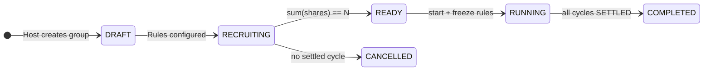
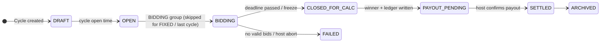

# Tong Tin Management System — Master Plan, Workflow & Skills Specification

> **Synthesis of [`docs/manus_ai`](docs/manus_ai) and [`docs/monkey_ai`](docs/monkey_ai)**
> **Status:** Planning Completed — `docs/monkey_ai/STATUS.md` = `CURRENT_STEP: 01` (Monorepo skeleton)
> **Execution rule:** ONE step per coding session until the user says otherwise.

---

## 1. Source Document Analysis

### 1.1 Document inventory and authority

| # | Document | Role | Authority |
|---|---|---|---|
| 1 | `monkey_ai/00-INDEX.md` | Reading order, source-of-truth pointer | Index |
| 2 | `monkey_ai/01-DOMAIN.md` | Actors, objects, states, bidding rules, money formulas, worked example | **Domain law** (change doc → then code) |
| 3 | `monkey_ai/02-ARCHITECTURE.md` | Stack, modules, Postgres schema, API outline, pages, security | **Architecture law** (new API → update doc → then code) |
| 4 | `monkey_ai/03-BUILD-ROADMAP.md` | Ordered Steps 00–17 with acceptance criteria + parked P1–P19 | **The plan** |
| 5 | `monkey_ai/04-AI-WORKFLOW.md` | Session boot sequence, hard rules, cheat sheets | **Session protocol** |
| 6 | `monkey_ai/05-OWNER-SELF-REGISTER.md` | Chu Hoi self-signup, tenant model, duplicate rules | Step 03 spec |
| 7 | `monkey_ai/06-SETTINGS-TEMPLATES-RISK.md` | Formula presets, meeting safety, owner-local blacklist, templates | Governance spec (mostly post-MVP) |
| 8 | `monkey_ai/07-MULTI-CURRENCY.md` | Minor units, `currencies` table, currency freeze, report shape | Schema law (from Step 02/05) |
| 9 | `monkey_ai/08-FORMULA-ENGINE.md` | Engine shape, presets, golden fixtures A–D, custom-formula limits | Test law (fixtures are golden) |
| 10 | `monkey_ai/STATUS.md` | `CURRENT_STEP`, done list, next action, blockers | **Live session state** |
| 11 | `manus_ai/…Product Blueprint (4).md` | Product blueprint: MVP scope, backlog Phases 0–5, acceptance tests §11, registration §14, governance §15, currency §16 | Product baseline (superseded where monkey_ai is more specific) |
| 12 | `manus_ai/…Multi-Currency DB & Formula Engine Design.md` | Detailed migration/AST/API-contract reference (`MULTI_CURRENCY_AND_FORMULA_DESIGN.md`) | Deep-dive reference |
| 13 | `manus_ai/…Project Context Memory.md` | Continuity record, product principles, open decisions | Principles |
| 14 | `manus_ai/…Blueprint (1)–(3).md`, plain `.md` | Earlier blueprint iterations | **Historical — do not build from** |

**Authority order when documents disagree:** `01-DOMAIN` / `02-ARCHITECTURE` / `03-BUILD-ROADMAP` (monkey_ai) → `08-FORMULA-ENGINE` fixtures → manus_ai blueprint (4) → older manus_ai iterations.

### 1.2 Key reconciliations (manus_ai vs monkey_ai)

| Domain Area | `manus_ai` recommendation | `monkey_ai` decision | Harmonized baseline |
|---|---|---|---|
| **Multi-Tenancy** | Host accounts + client profiles | `OwnerAccount` 1-1 with `HOST` user, scoped by `owner_id` | Public signup is **Owner-only** (`/auth/register-owner`). Members are paper `MemberProfile`s first; member login by invite later. |
| **Authentication** | Phone/email OTP, avoid passwords | Phone + password (BCrypt) + JWT with `ownerId` | Phone + password per `05-OWNER-SELF-REGISTER.md`; OTP deferred. |
| **Money** | Integer minor units + ISO 4217 | `BIGINT amount_minor` + `CHAR(3)` currency, never `double` | Zero-float policy. Exponent per currency (VND/KHR/LAK = 0, USD/THB/SGD = 2). Rates in bps (100 bps = 1%). |
| **Formula engine** | Structured AST + approval workflow | Pure Java calculator, presets + frozen parameters | MVP: `BIDDING_CLASSIC`, `FIXED_EQUAL`, `BIDDING_NO_FEE`. Custom = parameter clone only. **No eval/JS/Groovy/SQL ever at runtime.** |
| **Formula versioning** | Version + trace on every result | Preset id + engine version recorded on cycle | Record `formula version + all inputs` on each cycle result (calculation trace). |
| **Bidding window** | Sealed bids, frozen bid-set hash | Sealed until `bidCloseAt`; host blind to amounts; other members 403 | Server-side winner; amounts published only after close; bids immutable after close. |
| **Ledger** | Double-entry-inspired transactions | Append-only single-entry obligations | **Append-only.** Balances = derived views. Corrections = reversing entries. No deletes. |
| **State machines** | `DRAFT→ACTIVE→PAUSED→COMPLETED`; cycle 9 states | `DRAFT→RECRUITING→READY→RUNNING→COMPLETED`; cycle `DRAFT→OPEN→BIDDING→CLOSED_FOR_CALC→PAYOUT_PENDING→SETTLED` | **Use monkey_ai state names** (they drive API + schema). |
| **Cycle flow** | Host confirms result (2-person review above threshold) | `close-and-calculate` then `confirm-payout` | Host confirmation before payout stays mandatory; threshold-based dual approval = later. |
| **Risk & governance** | Platform blacklist, meeting records, dispute lock | Owner-local phone blacklist only; CycleSession/dispute lock parked as P15/P16 | No global blacklist in this product phase. Suggest, don't auto-ban. |
| **Notifications** | Email/in-app first | In-app only in MVP | In-app only; Zalo/Telegram/SMS parked (P3). |
| **Payments** | Manual recording; provider later | Host records real-world payments manually | Manual only; VietQR parked (P1). |
| **First build step** | "Rule Discovery Workshop / RULE_PROFILE_V1" | Step 00 planning already done; BIDDING_CLASSIC is the approved rule profile | RULE_PROFILE_V1 is **already satisfied** by `01-DOMAIN §9` + `08-FORMULA-ENGINE`. Start at Step 01. |

### 1.3 Hard invariants (never violated, all steps)

1. Money is `long` minor units + ISO currency — never `double`/`float`.
2. Formula engine is pure Java: zero Spring, zero DB, zero browser as source of truth.
3. All host data scoped by `owner_id`; no cross-tenant reads.
4. Public registration = Owners only. No public member register in MVP.
5. Sealed bids: hidden from host and other members until `bidCloseAt`; immutable after.
6. Ledger append-only; corrections via reversing entries.
7. One active cycle per group; cycle `k` opens only after `k-1` SETTLED.
8. Winner pays 0 that cycle, then becomes DEAD; last BIDDING cycle has `B = 0`, no auction.
9. One currency per group, frozen at START; reports always show currency; no FX.
10. No free-form formulas; presets + parameter clones only.
11. Vietnamese UI labels, English code identifiers.
12. Do not commit, delete files, or start the next step unless the user says so.

---

## 2. Reconciled Technical Baseline

### 2.1 State machines





Share: `ALIVE → DEAD` after receiving pot; `DEFAULTED` excludes from bidding but keeps debt.

### 2.2 Formulas (source of truth: `01-DOMAIN §9`, golden tests: `08-FORMULA-ENGINE §5`)

Notation: `C` base amount, `N` total shares, `D` dead shares, `A = N - D` alive, `B` winning bid, `T` host fee.

```
BIDDING_CLASSIC:  grossPot = D*C + (A-1)*(C-B);   netPayout = grossPot - T
FIXED_EQUAL:      grossPot = (N-1)*C;             netPayout = grossPot - T
Host fee T:       NONE=0 | FIXED_PER_CYCLE=value | PERCENT_OF_POT=round(grossPot*bps/10000) HALF_UP
```

**Golden fixtures (must unit-test exactly):**

| Fixture | Input | Expected |
|---|---|---|
| A.1 | N=10, C=1_000_000, T=100_000, D=0, A=10, B=200_000 | grossPot 7_200_000, **netPayout 7_100_000** |
| A.2 | D=1, A=9, B=150_000 | grossPot 7_800_000, **netPayout 7_700_000** |
| A.10 | D=9, A=1, B=0 (last) | grossPot 9_000_000, **netPayout 8_900_000** |
| B | USD exponent 2: N=10, C=10_000, T=500, B=2_000 | grossPot 72_000, **netPayout 71_500** (proves currency-blind) |
| C | FIXED_EQUAL VND, N=10, C=1_000_000, T=100_000 | every cycle netPayout **8_900_000** |
| D | reject | `B >= C`, `A+D != N`, last cycle `B != 0`, `T > grossPot` → error |

Host profit (all 10 cycles, same T): `10 × 100_000 = 1_000_000`.

### 2.3 Stack and layout

```
apps/web   Next.js App Router + TypeScript + Tailwind, rewrites /api/:path* → http://localhost:8080/api/:path*
apps/api   Java 21, Spring Boot 3 (Web, Validation, Security, Data JPA), Flyway, springdoc
docker-compose.yml   PostgreSQL 16 (+ api/web later)
API modules: common | identity | members | groups | cycles | bidding | ledger | notify | audit
```

### 2.4 Definition of Done for every step

1. Implement only the current step (no shortcuts into later steps).
2. Run the step's tests / manual accept checks (fixtures A–D are never skipped).
3. Verify the hard invariants above still hold.
4. Update `docs/monkey_ai/STATUS.md` (Done list + `CURRENT_STEP` advance + LAST_UPDATED).
5. **Stop.** Next step only on explicit user command. Commit only when asked.

---

## 3. Complete To-Do List (Steps 00–17)

Legend: `[x]` done · `[~]` current/partial · `[ ]` pending · **A** = acceptance criteria

### Phase A — Foundation (Steps 01–04)

- [x] **Step 00 — Planning artifacts** (DONE): domain, architecture, roadmap, workflow, owner-register, governance, multi-currency, formula rules, builder skill, slides.
- [~] **Step 01 — Monorepo skeleton** ← *CURRENT*
  - [ ] `apps/api`: Spring Boot empty app, `GET /api/v1/health`
  - [ ] `apps/web`: Next.js app + `/api` proxy rewrite
  - [ ] `docker-compose.yml`: PostgreSQL 16 with volume
  - [ ] Root README with run instructions
  - **A:** health returns `{"status":"UP"}`; Next.js page loads. (No owner signup here — that is Step 03.)
- [ ] **Step 02 — Database and Flyway**
  - [ ] Flyway `V1` identity tables (`users`, `user_roles`)
  - [ ] `currencies` lookup + seed VND, KHR, LAK, THB, USD, SGD (`07-MULTI-CURRENCY §7` placement)
  - **A:** app boots on empty DB, Flyway V1 runs clean.
- [ ] **Step 03 — Identity & owner self-register** (`05-OWNER-SELF-REGISTER.md`)
  - [ ] `POST /auth/register-owner` → User(HOST) + OwnerAccount
  - [ ] `POST /auth/login` (phone + password) → JWT containing `ownerId`
  - [ ] `GET /me`, `PATCH /me/owner-profile` (CCCD, bank fields)
  - **A:** duplicate phone → 409; `/api/v1/me` returns HOST + owner; second owner fully isolated; no public member register.
- [ ] **Step 04 — Member directory (host)**
  - [ ] `member_profiles` CRUD, unique phone per `owner_id`
  - **A:** host lists own members; cannot see another host's members.

### Phase B — Group setup (Steps 05–06)

- [ ] **Step 05 — Group draft**
  - [ ] `groups` create/update with all rule fields + currency FK
  - [ ] Validation: `N >= 2`, `C > 0`, `maxBid < C`, `bidStep > 0`, `cycleCount == N`
  - **A:** invalid `maxBid >= C` rejected.
- [ ] **Step 06 — Shares and READY**
  - [ ] `POST /groups/{id}/shares`, multi-share per member allowed
  - [ ] `POST /groups/{id}/start` → freeze rules, status RUNNING
  - **A:** cannot start unless `sum(shares) == N`; rules immutable after start.

### Phase C — Money core (Steps 07–11)

- [ ] **Step 07 — Formula engine (no HTTP)** ← *money-critical*
  - [ ] Pure Java `FormulaEngine.calculate(input) -> result`, no Spring/DB imports
  - [ ] `roundBps` HALF_UP helper
  - [ ] Fixtures A, B, C, D as unit tests (exact minor units)
  - **A:** cycle 1/2/last numbers match exactly (7_100_000 / 7_700_000 / 8_900_000).
- [ ] **Step 08 — Cycle open**
  - [ ] `POST /groups/{id}/cycles/open`
  - **A:** one active cycle per group; FIXED skips BIDDING; BIDDING enters BIDDING status.
- [ ] **Step 09 — Sealed bidding**
  - [ ] `POST /cycles/{id}/bids` submit/update until close; `is_latest` versioning
  - **A:** foreign bid → 403; host summary hides amounts before close; bids immutable after close.
- [ ] **Step 10 — Close and calculate**
  - [ ] `POST /cycles/{id}/close-and-calculate`: freeze bids, pick winner, tieBreak strategy, write ledger obligations (contributions + host fee + payout), publish summary, winner ALIVE→DEAD
  - **A:** example group settles to 7_100_000 net payout on cycle 1; ledger sums match.
- [ ] **Step 11 — Payments**
  - [ ] `POST /groups/{id}/payments` + `payment_allocations` (currency must match group; idempotent)
  - [ ] `GET /groups/{id}/debts` overdue list; late fee creates new entry, never rewrites obligation
  - **A:** allocations cannot over-pay an obligation; partial payments supported.

### Phase D — Experience (Steps 12–15)

- [ ] **Step 12 — Host dashboard**: groups, next due, unpaid count, estimated host profit — **partitioned by currency, never summed across currencies**.
- [ ] **Step 13 — Member portal**: `/app` my groups, bid screen, balance statement (`contributed/received/fees/netPosition`).
- [ ] **Step 14 — In-app notifications**: events from `01-DOMAIN §13` (cycle opened, bid reminders T-24h/T-2h, winner published, due, overdue, payout ready, confirmed, group completed). Notification failure must never mutate financial state.
- [ ] **Step 15 — Reports**: host profit, member statement, public cycle summary; money payload `{"currency","amountMinor","exponent","symbol"}`; formula version shown.

### Phase E — Hardening (Steps 16–17)

- [ ] **Step 16 — Hardening**: `audit_events` on all money/winner actions, cross-tenant authz tests, money rounding tests, demo seeder (fixture from STATUS.md).
- [ ] **Step 17 — Preview polish**: Vietnamese copy, `1.000.000 đ` formatting, empty states, `allowedHosts` for preview env, start script.

### Cross-cutting release gates (from manus_ai §11 + §14 + §16)

- [ ] Member cannot read another member's sealed bid before close; closed bid uneditable via normal API.
- [ ] Tie resolved by stored `tieBreak`, not server ordering.
- [ ] Retrying a contribution/payout event does not duplicate money (idempotency keys).
- [ ] Failed notification never changes financial state.
- [ ] Corrections create reversal trails; history never erased.
- [ ] Every payout shows gross pot, deductions, fee, rounding, winner, formula version.
- [ ] Member statement reproducible from ledger events.
- [ ] Rules frozen after first cycle; changes require new version + acknowledgement (post-MVP enforcement point).
- [ ] All amounts integer minor units; float currency math prohibited (grep-level check).
- [ ] Currency locked at first active cycle; a VND group rejects USD transactions.

### Parked — NOT in MVP (do not schedule unless user asks)

- P1 VietQR · P2 Excel/PDF sổ sách · P3 Zalo/Telegram/SMS · P4 guarantor/deposit · P5 member reputation · P6 calendar heatmap · P7 host what-if simulator · P8 commit-reveal bids · P9 PWA · P10 dark mode/keypad · P11 dispute PDF snapshot · P13 owner default formula · P14 group design templates (mẫu hụi) · P15 owner-local blacklist · P16 CycleSession attendance + dispute lock · P17 print templates · P18 extra currencies · P19 FX dashboard.
- Earliest sensible code (if ever promoted): P15 after Step 04, P13/P14 after Step 05, P16 after Step 10, P17 after Step 15.
- Explicitly out of scope: RANDOM group type, FIRST_CYCLE_TO_HOST fee, microservices, free-form formula editor, global blacklist, AI choosing winners.

---

## 4. To-Do List Workflow (per AI session)

### 4.1 Boot sequence (from `04-AI-WORKFLOW.md`)

```
1. Read docs/monkey_ai/STATUS.md          → identify CURRENT_STEP
2. Read docs/monkey_ai/01-DOMAIN.md       → if task touches money, bids, or states
3. Read the current step in 03-BUILD-ROADMAP.md + its spec doc (05/07/08 as needed)
4. Load skill: tongtin-builder
5. Implement ONLY that step
6. Run the step's acceptance checks (fixtures never skipped)
7. Update STATUS.md: tick Done, advance CURRENT_STEP, LAST_UPDATED, blockers
8. STOP — do not start the next step unless the user says so
```

### 4.2 Session loop

```
[user: "Continue Tong Tin from docs/STATUS.md. Do only the current step."]
   → boot sequence → implement → verify → update STATUS → report + stop
```

### 4.3 Gates

| Gate | Rule |
|---|---|
| **Start gate** | No coding until STATUS says the current step is a code step (it does: Step 01). |
| **Step gate** | Do not implement step *k+1* before step *k* acceptance passes. |
| **Doc gate** | Domain change → update `01-DOMAIN.md` first; new API → update `02-ARCHITECTURE.md` first. |
| **Status gate** | Update STATUS only after acceptance checks pass, never on intent. |
| **Commit gate** | Commit/push only on explicit user request. |
| **Invariant gate** | Any PR touching money must re-verify invariants §1.3 (items 1, 2, 6). |

### 4.4 Master checklist maintenance

- This document = **plan of record**; `03-BUILD-ROADMAP.md` = **step of record**; `STATUS.md` = **live state**.
- When a step completes: tick it here, advance STATUS, note any deviation between this doc and the roadmap in the step's entry.

---

## 5. Skills to Build It

### 5.1 Primary agent skill (already installed)

**[`tongtin-builder`](.agents/skills/tongtin-builder/SKILL.md)** — the governing skill:
- Boots from `STATUS.md`, executes exactly one step, verifies acceptance, updates STATUS, stops.
- Carries the hard invariants (money/floating-point, pure-Java formulas, tenant boundary, sealed bids, append-only ledger, owner-only signup).
- Maps each topic to its spec doc (01/02/05/06/07/08).
- Trigger phrase: *"Continue Tong Tin from docs/STATUS.md. Do only the current step."*

> Note: `04-AI-WORKFLOW.md` and `00-INDEX.md` still reference the old path `.opencode/skills/tongtin-continue/SKILL.md`. The live skill is `.agents/skills/tongtin-builder/SKILL.md` — treat the old path as an alias and update the docs when convenient.

### 5.2 Supporting skills per phase

| Phase | Skill | Use for |
|---|---|---|
| Any implementation | `tongtin-builder` | Step discipline + STATUS loop |
| Steps 07, 10, 16 | `bug-hunter` | Trace calculation mismatches from fixture failures to root cause |
| Any code review | `brooks-lint`, `logic-lens` | Design-smell / logic review of ledger & cycle state machine before marking a step done |
| Steps 11, 16 | `api-endpoint-builder` | Production-grade payment/endpoint patterns (validation, errors, authz) — still under step gate |
| Step 07+ test work | `performance-optimizer` (later) | Only if cycle close or reports show latency issues |
| Before any push | `codebase-audit-pre-push`, `technical-change-tracker` | Junk/dead-code/secret sweep + structured change records |
| Skill maintenance | `skill-creator`, `skill-check` | Evolve `tongtin-builder` when workflow rules change |

### 5.3 Engineering competencies required

| Area | Tools | Responsibility in Tong Tin |
|---|---|---|
| Backend | Java 21, Spring Boot 3, Spring Data JPA, Spring Security, Flyway, JWT | Modular monolith (`identity/groups/cycles/bidding/ledger/notify/audit`); pure zero-dependency `FormulaEngine`; forward-only migrations. |
| Financial math | `long` minor units, bps, HALF_UP rounding, append-only ledger, state machines | Exact fixture equality; reversing entries; idempotent allocations; no float anywhere. |
| Frontend | Next.js App Router, TypeScript, Tailwind, `Intl.NumberFormat` | `/api` proxy; Host & Member portals; Vietnamese labels + `1.000.000 đ`. |
| DB & security | PostgreSQL 16, RBAC, partial unique indexes | `owner_id` isolation; sealed-bid confidentiality; audit trail; BIGINT money + CHAR(3) currency. |
| Testing | JUnit 5, AssertJ, (TestContainers) | Fixtures A–D exact; cross-tenant 403 tests; money-rounding and idempotency tests. |

---

## 6. Immediate Next Action

STATUS says: when the user says to build, execute **Step 01 only** —

```
Create apps/api Spring Boot health API,
      apps/web Next.js with /api proxy,
      docker-compose Postgres,
      root README.
Accept: GET /api/v1/health → {"status":"UP"}; Next.js page loads.
```

Owner signup belongs to Step 03 — do not code it in Step 01.
