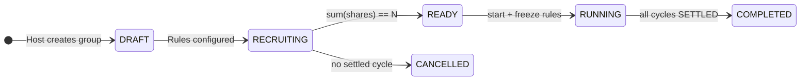
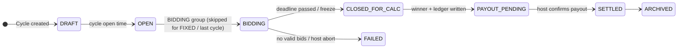

# Tong Tin Management System — plan.md

> **Single source plan** synthesized from [`docs/manus_ai`](docs/manus_ai) and [`docs/monkey_ai`](docs/monkey_ai).
> **Live status lives in [`docs/monkey_ai/STATUS.md`](docs/monkey_ai/STATUS.md)** — update it after every completed step.
> **Execution rule:** ONE step per coding session until the user says otherwise.

---

## 0. Build Status (check here + STATUS.md)

| Step | Title | Status |
|---|---|---|
| 00 | Planning artifacts | ✅ DONE |
| 01 | Monorepo skeleton | ✅ DONE (2026-10-06) — health UP direct + proxy, web loads, mvn test / lint / build pass |
| 02 | Database and Flyway | ✅ DONE (2026-10-06) — V1 users + user_roles, Flyway applied, restart idempotent |
| 03 | Identity & owner self-register | ✅ DONE (2026-10-06) — register/login/refresh/me + V2 owner_accounts, 11 tests pass |
| 04 | Member directory (host) | ✅ DONE (2026-10-06) — V2.1 member_profiles, CRUD + ?q=, cross-tenant 404, 17 tests pass |
| 05 | Group draft | ✅ DONE (2026-10-06) — V3 currencies+groups, HOI codes, draft validation, 26 tests pass |
| 06 | Shares and READY | ✅ DONE (2026-10-06) — V4 shares, assign/remove, start frees rules, 32 tests pass |
| 07 | Formula engine (no HTTP) | ✅ DONE (2026-10-06) — v1 presets + fixtures A-D exact, 40 tests pass |
| 08 | Cycle open | ✅ DONE (2026-10-06) — V5 cycles, BIDDING/OPEN states, 47 tests pass |
| 09 | Sealed bidding | ✅ DONE (2026-10-06) — V6 bids, latest-wins, sealed summary, 56 tests pass |
| 10 | Close and calculate | ✅ DONE (2026-10-06) — V7 ledger_entries, winner + ledger + confirm-payout, 69 tests pass |
| 11 | Payments | ✅ DONE (2026-10-07) — V8 payments + allocations, POST /payments + GET /debts, 81 tests pass |
| 12 | Host dashboard | ✅ DONE (2026-10-07) — GET /host/dashboard: groups + next due + unpaid/overdue + per-currency profit (SETTLED fees, money shape), 87 tests pass |
| 13 | Member portal | ✅ DONE (2026-10-07) — host-set member login + GET /me/groups, /me/groups/{id}, /me/groups/{id}/balance, POST /me/cycles/{id}/bids, 93 tests pass |
| 14 | In-app notifications | ✅ DONE (2026-10-07) — V9 notifications table + com.tongtin.notify module; CYCLE_OPENED / WINNER_PUBLISHED / PAYOUT_READY / PAYMENT_CONFIRMED / GROUP_COMPLETED / MEMBER_LOGIN_NOTICE (sync transitions only, user-confirmed); own-feed GET /notifications + unread-count + read + read-all; 6 new NotificationTests → 99 tests pass |
| 15 | Reports | ✅ DONE (2026-10-07) — com.tongtin.reports: HOST GET /groups/{id}/ledger + /profit (formulaVersion, totals, settledHostFee), MEMBER GET /me/groups/{id}/statement (runningBalance + totals per 01-DOMAIN §9.5) + /me/groups/{id}/cycles public summary (hostFee/profit never exposed); all money via com.tongtin.common.money.Money shape; 8 new tests → 107 pass |
| 16 | Hardening | ✅ DONE (2026-10-07) — V10 payment Idempotency-Key replay 200 / mismatch 409, audit_events on all money/winner actions, rounding boundary tests, authz sweep matrix, demo seeder (app.seed-demo=true) reproducing N=10 fixture A, 119 tests pass |
| 17 | Preview polish | ✅ DONE (2026-10-07) — Vietnamese UI copy first (1.000.000 đ), modern web UX & dark mode, host & member portal routes, preview allowedOrigins, all-in-one start.sh, npm run build (11/11 routes) & lint 0 errors, 119 tests pass |
| 18 | Final delivery & wrap-up | ✅ DONE (2026-10-07) — End-to-end verification (10/10 checks pass), audit trail verified, comprehensive README, all-in-one start.sh --seed, 119 tests pass |
| 19 | SaaS subscriptions & ABA PayWay | ✅ DONE (2026-10-07) — 1-month free trial, PayWay HMAC-SHA512 checkout/KHQR, admin plans/hosts/orders, V11; post-delivery security fixes + lifecycle job (see §7) |
| 20 | Centralized settings module | ✅ DONE (2026-10-07) — catalog-driven `SettingsService` + `/api/v1/admin/settings` + admin UI (4 categories / 15 keys), 8 consumers rewired, `AdminSettingsTests` → 141 tests pass (see §8) |
| 21 | Docker deployment (full stack) | ✅ DONE (2026-10-07) — multi-stage Dockerfiles (api + web), Docker Compose with postgres/api/web + healthcheck-gated startup, Next.js standalone build, `.env.example`; 3 containers healthy, health UP direct + via proxy, login e2e 200 (see §9) |
| 22 | Release-gate audit | ✅ DONE (2026-10-08) — plan.md §3 all 10 cross-cutting gates ticked with test evidence, new `ReleaseGateTests` (4), `mvn test` → 145 tests pass (see §11) |
| 24 | Real ABA PayWay return flow | ✅ DONE (2026-10-08) — absolute same-origin return URLs composed server-side (`?status&tran_id`), gateway-return handling on `/host/subscription` with authoritative re-verify, cross-origin/smuggled-param rejection, 5 new tests → 150 pass (see §12) |
| 25 | payment_events forensics + callback rate limit | ✅ DONE (2026-10-08) — V12 append-only `payment_events` (CALLBACK/CHECK journals, raw payloads), per-IP sliding-window 429 on webhook via `rate_limit_payway_callback_per_minute` (SECURITY catalog), 6 new tests → 156 pass (see §13) |
| 26 | Checkout idempotency (reuse PENDING order) | ✅ DONE (2026-10-08) — same (owner, plan) checkout within `checkout_pending_reuse_minutes` reuses PENDING order (same tran_id/req_time, hash rebuilt); PAID/expired never reused; 5 new tests → 161 pass (see §14) |
| 27 | Subscription index + admin insights | ✅ DONE (2026-10-08) — V13 `idx_owner_sub_ends_status` for lifecycle scan; `GET /admin/insights` (revenue/PAID per plan + per-currency totals + cohort/churn) + new Insights admin tab; 4 new tests → 165 pass (see §15) |
| 28 | Testcontainers hermetic test suite | ✅ DONE (2026-10-08) — singleton `postgres:16` per JVM via `spring.factories` initializer, `testcontainers.version` 1.21.4 override for Docker Engine 29; 165 pass WITH dev postgres stopped (see §16) |
| 29 | Late fees (host-triggered assessment) | ✅ DONE (2026-10-08) — V14 late-fee partial index, `FormulaEngine.lateFee` (half-up), `LateFeeService` cumulative delta idempotency, `POST /groups/{id}/late-fees/assess`, Apply-Late-Fees button + i18n x4; 14 new tests → 179 pass (see §17) |
| 30 | CSV/Excel export (ledger, profit, member statement) | ✅ DONE (2026-10-08) — poi-ooxml 5.5.1, CSV (UTF-8 BOM + RFC 4180 + formula-injection guard) and real .xlsx; `GET /export/{ledger,profit}` (HOST) + `/me/groups/{id}/export/statement` (MEMBER); `com.tongtin.reports.export` renders the Step 15 report DTOs (no new queries/math); buttons + i18n x12; 5 new tests → 184 pass (see §18) |
| 31 | Wrap-up & cleanup | ✅ DONE (2026-10-08) — stale docs refreshed (README/00-INDEX/02-ARCH §3/03-BUILD-ROADMAP), Docker compose rebuilt + click-through (all 3 healthy, Flyway V1→V14 on existing volume, export sweep live), final `mvn test` 184 pass + `npm run build` 13/13 (see §19) |
| 32 | Attachments (receipts + member docs) | ✅ DONE (2026-10-09) — V15 `attachments` BYTEA (owner-scoped, no path vector), `com.tongtin.attachments` HOST upload/stream/delete, new `GET /groups/{id}/payments` history, `storage_attachment_*` SECURITY settings, host receipts UI + member Files modal, i18n ×4; 7 new `AttachmentTests` → 191 pass (see §21) |
| 33 | Blacklist + enforced member status | ✅ DONE (2026-10-09) — V16 `member_blacklists` (owner-local phone list, soft unlist), `com.tongtin.members.blacklist` HOST manager API + UI, BLOCKED→no login, INACTIVE/BLOCKED→no bid, blacklisted phone → 409 on add-member/add-share, status column + i18n ×4; 5 new `BlacklistTests` → 196 pass (see §22) |
| 34 | KHQR per obligation (real EMVCo CRC16) | ✅ DONE (2026-10-09) — `com.tongtin.khqr`: pure EMVCo generator (CRC16-CCITT 0x1021, golden 0x29B1) + `ObligationQrService`/`ObligationQrController` (image/png render), `khqr` on debts + statement rows (IN/remaining>0 only), `payments_khqr_enabled` setting, zxing 3.5.3; host debts + member statement QR modals, i18n ×4; 10 new `KhqrTests` → 206 pass (see §23) |
| 35 | Telegram per-host chat + events + daily due-digest | ✅ DONE (2026-10-09) — V17 `owner_accounts.telegram_chat_id`, `com.tongtin.telegram` (client seam `BotApiTelegramClient`, best-effort `TelegramNotifier`, pure `TelegramMessages`, `TelegramService`, gated `TelegramDigestJob`), TELEGRAM settings category (bot token / events / digest toggle+time), host-only chat-id link + test-send + audit, six event hooks, `/host/telegram` page + navbar + i18n ×4; 7 new `TelegramTests` (mock client, zero network) → 213 pass (see §24) |
| 36 | Quick-pay single-step settlement | ✅ DONE (2026-10-09) — `POST /groups/{id}/quick-pay`: host picks member + total, backend auto-allocates oldest-due-first (then entry id) incl. LATE_FEE (opt-out) across the member's UNPAID/PARTIAL direction-IN debts via SHARED `recordCore` (audit `autoAllocated`), normal payments row + idempotency replay + fail-fast guards; host modal + i18n ×4; 11 new `QuickPayTests` → 224 pass (see §25) |
| 37 | Wrap-up: full docs pass, suite + build + Docker click-through, close-out | ✅ DONE (2026-10-09) — README.md + README_VN.md refreshed (badges 224, migrations V1→V17, 14 routes, module tree + attachments/khqr/telegram, 37-step roadmap incl. Phase 2 rows), 03-BUILD-ROADMAP Phase 2 table + stale row-31 fix, plan.md §26, STATUS close-out; `mvn -o package` BUILD SUCCESS (full suite 224/0 + jar), `npm run build` 14/14, Docker compose rebuilt + click-through (postgres/api/web all healthy; api health 200, web /login 200, api auth 401) (see §26) |

**Overall phase:** `complete` — Steps 00–37 all done (suite **224**, web lint/tsc/build clean, Docker stack green, nothing committed).
**Blockers:** none.
**Next action:** Phase 2 continues with **Step 36 — Quick-pay single-step settlement** (plan §20). Step 23 collapsed (audit found no behavior gaps).

### Easy follow steps (how to run every session)

1. Read `docs/monkey_ai/STATUS.md` → find `CURRENT_STEP`.
2. Read that step in `docs/monkey_ai/03-BUILD-ROADMAP.md` (+ spec doc `01`/`05`/`07`/`08` if needed).
3. Load skill `tongtin-builder`.
4. Implement **only** that step.
5. Run the step's acceptance checks (formula fixtures never skipped).
6. Tick this file's status table + update `STATUS.md` (Done, CURRENT_STEP, LAST_UPDATED).
7. **Stop.** Next step only when the user asks. Commit only when the user asks.

**Trigger phrase:** `Continue Tong Tin from docs/STATUS.md. Do only the current step.`

---

## 1. Source Document Analysis

### 1.1 Document inventory and authority

| # | Document | Role | Authority |
|---|---|---|---|
| 1 | `monkey_ai/00-INDEX.md` | Reading order, source-of-truth pointer | Index |
| 2 | `monkey_ai/01-DOMAIN.md` | Actors, objects, states, bidding rules, money formulas, worked example | **Domain law** (change doc → then code) |
| 3 | `monkey_ai/02-ARCHITECTURE.md` | Stack, modules, Postgres schema, API outline, pages, security | **Architecture law** (new API → update doc → then code) |
| 4 | `monkey_ai/03-BUILD-ROADMAP.md` | Ordered Steps 00–17 with acceptance criteria + parked P1–P19 | **The plan** |
| 5 | `monkey_ai/04-AI-WORKFLOW.md` | Session boot sequence, hard rules, cheat sheets | **Session protocol** |
| 6 | `monkey_ai/05-OWNER-SELF-REGISTER.md` | Chu Hoi self-signup, tenant model, duplicate rules | Step 03 spec |
| 7 | `monkey_ai/06-SETTINGS-TEMPLATES-RISK.md` | Formula presets, meeting safety, owner-local blacklist, templates | Governance spec (mostly post-MVP) |
| 8 | `monkey_ai/07-MULTI-CURRENCY.md` | Minor units, `currencies` table, currency freeze, report shape | Schema law (from Step 02/05) |
| 9 | `monkey_ai/08-FORMULA-ENGINE.md` | Engine shape, presets, golden fixtures A–D, custom-formula limits | Test law (fixtures are golden) |
| 10 | `monkey_ai/STATUS.md` | `CURRENT_STEP`, done list, next action, blockers | **Live session state** |
| 11 | `manus_ai/…Product Blueprint (4).md` | MVP scope, backlog Phases 0–5, acceptance tests §11, registration §14, governance §15, currency §16 | Product baseline (superseded where monkey_ai is more specific) |
| 12 | `manus_ai/…Multi-Currency DB & Formula Engine Design.md` | Detailed migration/AST/API-contract reference | Deep-dive reference |
| 13 | `manus_ai/…Project Context Memory.md` | Continuity record, product principles, open decisions | Principles |
| 14 | `manus_ai/…Blueprint (1)–(3).md`, plain `.md` | Earlier blueprint iterations | **Historical — do not build from** |

**Authority order when documents disagree:** `01-DOMAIN` / `02-ARCHITECTURE` / `03-BUILD-ROADMAP` (monkey_ai) → `08-FORMULA-ENGINE` fixtures → manus_ai blueprint (4) → older manus_ai iterations.

### 1.2 Key reconciliations (manus_ai vs monkey_ai)

| Domain Area | `manus_ai` recommendation | `monkey_ai` decision | Harmonized baseline |
|---|---|---|---|
| **Multi-Tenancy** | Host accounts + client profiles | `OwnerAccount` 1-1 with `HOST` user, scoped by `owner_id` | Public signup is **Owner-only** (`/auth/register-owner`). Members are paper `MemberProfile`s first; member login by invite later. |
| **Authentication** | Phone/email OTP, avoid passwords | Phone + password (BCrypt) + JWT with `ownerId` | Phone + password per `05-OWNER-SELF-REGISTER.md`; OTP deferred. |
| **Money** | Integer minor units + ISO 4217 | `BIGINT amount_minor` + `CHAR(3)` currency, never `double` | Zero-float policy. Exponent per currency (VND/KHR/LAK = 0, USD/THB/SGD = 2). Rates in bps (100 bps = 1%). |
| **Formula engine** | Structured AST + approval workflow | Pure Java calculator, presets + frozen parameters | MVP: `BIDDING_CLASSIC`, `FIXED_EQUAL`, `BIDDING_NO_FEE`. Custom = parameter clone only. **No eval/JS/Groovy/SQL ever at runtime.** |
| **Formula versioning** | Version + trace on every result | Preset id + engine version recorded on cycle | Record `formula version + all inputs` on each cycle result (calculation trace). |
| **Bidding window** | Sealed bids, frozen bid-set hash | Sealed until `bidCloseAt`; host blind to amounts; other members 403 | Server-side winner; amounts published only after close; bids immutable after close. |
| **Ledger** | Double-entry-inspired transactions | Append-only single-entry obligations | **Append-only.** Balances = derived views. Corrections = reversing entries. No deletes. |
| **State machines** | `DRAFT→ACTIVE→PAUSED→COMPLETED`; cycle 9 states | `DRAFT→RECRUITING→READY→RUNNING→COMPLETED`; cycle `DRAFT→OPEN→BIDDING→CLOSED_FOR_CALC→PAYOUT_PENDING→SETTLED` | **Use monkey_ai state names** (they drive API + schema). |
| **Cycle flow** | Host confirms result (2-person review above threshold) | `close-and-calculate` then `confirm-payout` | Host confirmation before payout stays mandatory; threshold-based dual approval = later. |
| **Risk & governance** | Platform blacklist, meeting records, dispute lock | Owner-local phone blacklist only; CycleSession/dispute lock parked as P15/P16 | No global blacklist in this product phase. Suggest, don't auto-ban. |
| **Notifications** | Email/in-app first | In-app only in MVP | In-app only; Zalo/Telegram/SMS parked (P3). |
| **Payments** | Manual recording; provider later | Host records real-world payments manually | Manual only; VietQR parked (P1). |
| **First build step** | "Rule Discovery Workshop / RULE_PROFILE_V1" | Step 00 planning already done; BIDDING_CLASSIC is the approved rule profile | RULE_PROFILE_V1 is **already satisfied** by `01-DOMAIN §9` + `08-FORMULA-ENGINE`. Start at Step 01. |

### 1.3 Hard invariants (never violated, all steps)

1. Money is `long` minor units + ISO currency — never `double`/`float`.
2. Formula engine is pure Java: zero Spring, zero DB, zero browser as source of truth.
3. All host data scoped by `owner_id`; no cross-tenant reads.
4. Public registration = Owners only. No public member register in MVP.
5. Sealed bids: hidden from host and other members until `bidCloseAt`; immutable after.
6. Ledger append-only; corrections via reversing entries.
7. One active cycle per group; cycle `k` opens only after `k-1` SETTLED.
8. Winner pays 0 that cycle, then becomes DEAD; last BIDDING cycle has `B = 0`, no auction.
9. One currency per group, frozen at START; reports always show currency; no FX.
10. No free-form formulas; presets + parameter clones only.
11. Vietnamese UI labels, English code identifiers.
12. Do not commit, delete files, or start the next step unless the user says so.

---

## 2. Reconciled Technical Baseline

### 2.1 State machines





Share: `ALIVE → DEAD` after receiving pot; `DEFAULTED` excludes from bidding but keeps debt.

### 2.2 Formulas (source of truth: `01-DOMAIN §9`, golden tests: `08-FORMULA-ENGINE §5`)

Notation: `C` base amount, `N` total shares, `D` dead shares, `A = N - D` alive, `B` winning bid, `T` host fee.

```
BIDDING_CLASSIC:  grossPot = D*C + (A-1)*(C-B);   netPayout = grossPot - T
FIXED_EQUAL:      grossPot = (N-1)*C;             netPayout = grossPot - T
Host fee T:       NONE=0 | FIXED_PER_CYCLE=value | PERCENT_OF_POT=round(grossPot*bps/10000) HALF_UP
```

**Golden fixtures (must unit-test exactly):**

| Fixture | Input | Expected |
|---|---|---|
| A.1 | N=10, C=1_000_000, T=100_000, D=0, A=10, B=200_000 | grossPot 7_200_000, **netPayout 7_100_000** |
| A.2 | D=1, A=9, B=150_000 | grossPot 7_800_000, **netPayout 7_700_000** |
| A.10 | D=9, A=1, B=0 (last) | grossPot 9_000_000, **netPayout 8_900_000** |
| B | USD exponent 2: N=10, C=10_000, T=500, B=2_000 | grossPot 72_000, **netPayout 71_500** (proves currency-blind) |
| C | FIXED_EQUAL VND, N=10, C=1_000_000, T=100_000 | every cycle netPayout **8_900_000** |
| D | reject | `B >= C`, `A+D != N`, last cycle `B != 0`, `T > grossPot` → error |

Host profit (all 10 cycles, same T): `10 × 100_000 = 1_000_000`.

### 2.3 Stack and layout

```
apps/web   Next.js App Router + TypeScript + Tailwind, rewrites /api/:path* → http://localhost:8080/api/:path*
apps/api   Java 21, Spring Boot 3 (Web, Validation, Security, Data JPA), Flyway, springdoc
docker-compose.yml   PostgreSQL 16 (+ api/web later)
API modules: common | identity | members | groups | cycles | bidding | ledger | notify | audit
```

### 2.4 Definition of Done for every step

1. Implement only the current step (no shortcuts into later steps).
2. Run the step's tests / manual accept checks (fixtures A–D are never skipped).
3. Verify the hard invariants above still hold.
4. Update `docs/monkey_ai/STATUS.md` (Done list + `CURRENT_STEP` advance + LAST_UPDATED) and this file's §0 table.
5. **Stop.** Next step only on explicit user command. Commit only when asked.

---

## 3. Complete To-Do List (Steps 00–17)

Legend: `[x]` done · `[~]` current/partial · `[ ]` pending · **A** = acceptance criteria

### Phase A — Foundation (Steps 01–04)

- [x] **Step 00 — Planning artifacts** (DONE): domain, architecture, roadmap, workflow, owner-register, governance, multi-currency, formula rules, builder skill, slides.
- [x] **Step 01 — Monorepo skeleton** ✅ DONE 2026-10-06
  - [x] `apps/api`: Spring Boot empty app, `GET /api/v1/health` → `{"status":"UP"}`
  - [x] `apps/web`: Next.js 16 app + `/api` proxy rewrite (verified through proxy)
  - [x] `docker-compose.yml`: PostgreSQL 16 with volume, healthy
  - [x] Root README with run instructions
  - **A:** ✅ health returns `{"status":"UP"}` direct + via proxy; Next.js page loads; `mvn test`, `npm run lint`, `npm run build` pass.
- [x] **Step 02 — Database and Flyway** ✅ DONE 2026-10-06
  - [x] Spring Boot `postgresql`, `spring-boot-starter-data-jpa`, `flyway-core` + `flyway-database-postgresql`, datasource config
  - [x] Flyway `V1__init_identity.sql`: `users` (email unique nullable, phone unique), `user_roles`
  - [x] `currencies` seed deferred to V3/Step 05 per `07-MULTI-CURRENCY §7`
  - **A:** ✅ app booted on empty DB, "Successfully applied 1 migration"; restart "up to date"; `mvn test` passes.
- [x] **Step 03 — Identity & owner self-register** ✅ DONE 2026-10-06 (`05-OWNER-SELF-REGISTER.md`)
  - [x] Flyway V2: `owner_accounts` + `audit_events`
  - [x] `POST /auth/register-owner` → User(HOST) + OwnerAccount + audit OWNER_REGISTERED
  - [x] `POST /auth/login` (phone + BCrypt) → JWT with `sub`/`ownerId`/`roles`; `POST /auth/refresh`
  - [x] `GET /me`, `PATCH /me/owner-profile` (CCCD, bank, zalo, city)
  - [x] Rate limit (register 20/h/IP), phone E.164 normalization
  - **A:** ✅ duplicate phone → 409; `/api/v1/me` returns HOST + owner; second owner distinct `ownerId`; no generic `/auth/register` (404); password not plaintext; 11 tests pass.
- [x] **Step 04 — Member directory (host)** ✅ DONE 2026-10-06
  - [x] `member_profiles` (V2_1), unique phone per `owner_id`, doc gate updated `02-ARCHITECTURE §5`
  - **A:** ✅ host lists own members; other host empty list + 404 on foreign ids; 17 tests pass.

### Phase B — Group setup (Steps 05–06)

- [x] **Step 05 — Group draft** ✅ DONE 2026-10-06
  - [x] V3: currencies seed + groups (currency FK, `CHECK max_bid < base_amount`, minor-unit BIGINT)
  - [x] `POST/PATCH/GET /groups` (DRAFT edits only), code `HOI-YYYY-NNN`, doc gate `02-ARCHITECTURE §4` synced
  - **A:** ✅ `maxBid >= C` rejected 400; unknown currency 400; FK enforced; 26 tests pass.
- [x] **Step 06 — Shares and READY** ✅ DONE 2026-10-06
  - [x] `POST /groups/{id}/shares`, multi-share per member allowed; first assign -> RECRUITING
  - [x] `POST /groups/{id}/start` → READY + rules frozen (cycle 1 later flips RUNNING)
  -  **A:** ✅ cycle 1/2/last numbers match exactly (7_100_000 / 7_700_000 / 8_900_000).

### Phase C — Money core (Steps 07–11)

- [x] **Step 07 — Formula engine (no HTTP)** ✅ DONE 2026-10-06
  - [x] Pure Java `FormulaEngine.calculate(input) -> result`, no Spring/DB imports
  - [x] `roundBps` HALF_UP helper
  - [x] Fixtures A, B, C, D as unit tests (exact minor units) + 20 random-invariant inputs
  - **A:** ✅ cycle 1/2/last numbers match exactly (7_100_000 / 7_700_000 / 8_900_000).
- [x] **Step 08 — Cycle open** ✅ DONE 2026-10-06
  - [x] V5 cycles (cycle_no unique, won_cycle_id FK, status machine), `POST /groups/{id}/cycles/open`
  - **A:** ✅ one active cycle per group; READY->RUNNING; FIXED/last skip BIDDING; 47 tests pass.
- [x] **Step 09 — Sealed bidding** ✅ DONE 2026-10-06
  - [x] V6 bids (partial unique `is_latest` per cycle+share); `POST /cycles/{id}/bids` submit/update until close
  - [x] `GET /cycles/{id}/summary` sealed (amounts hidden before `bid_close_at`)
  - [x] *Host enters bids for members (scaled back); member write auth arrives Step 13*
  - **A:** ✅ foreign bid → 403; invalid bid → 400; summary hides amounts before close, reveals after; 56 tests pass.
- [x] **Step 10 — Close and calculate** ✅ DONE 2026-10-06
  - [x] V7 ledger_entries (append-only, partial unique duplicate-close insurance); `POST /cycles/{id}/close-and-calculate` freezes bids, picks winner (tieBreak per group config), runs engine, writes obligations, winner ALIVE→DEAD
  - [x] `POST /cycles/{id}/confirm-payout`: PAYOUT_PENDING→SETTLED, marks payout+fee entries PAID, last cycle → group COMPLETED; summary reveals amounts + winner after close
  - [x] *Decisions: FIXED winner = lowest live share_no per cycle; LOWEST_MEMBER_CODE = lowest share_no; HOST_DECISION needs {winnerShareId} among tied; DEFAULTED pays full C, counted in D*
  - **A:** ✅ fixture A cycle 1 settles to 7_100_000 (ledger SUM(IN)=SUM(OUT)=7_200_000), cycle 2 → 7_700_000; 69 tests pass.
- [x] **Step 11 — Payments** ✅ DONE 2026-10-07
  - [x] V8 payments + payment_allocations (amount_minor > 0, method CHECK, unique allocation per payment+entry); `POST /groups/{id}/payments` — 404 cross-owner, 409 currency mismatch, allocations sum exactly to amount, pessimistic locks, over-allocation 400, UNPAID/PARTIAL → PARTIAL/PAID
  - [x] `GET /groups/{id}/debts` overdue list with cycleNo, allocated/remaining, overdueDays; late fee DEFERRED (user decision) — LATE_FEE row creation not in Step 11
  - [x] *Decisions: sum(allocations) == amountMinor exactly; method default CASH; paidAt optional ISO; no idempotency key yet (release gate); allocations never rewrite amount, only status*
  - **A:** ✅ partial 300000 → PAID after rest; over-allocate 400; USD 409; foreign entry 404; debts shows only overdue with overdueDays 3; 81 tests pass.

### Phase D — Experience (Steps 12–15)

- [x] **Step 12 — Host dashboard** ✅ DONE 2026-10-07: GET /host/dashboard — groups ordered newest-first (status, currentCycleNo/Status), nextDueAt (earliest UNPAID/PARTIAL due), unpaidCount + overdueCount, hostProfitMinor (SUM settled cycles.host_fee), and `currencies[]` per-currency profit in money shape — **partitioned by currency, never summed across currencies**; PAYOUT_PENDING not counted.
- [x] **Step 13 — Member portal** ✅ DONE 2026-10-07: member auth = host-set password (POST /members/{id}/set-login), shared /auth/login role-agnostic; GET /me/groups {..}, /me/groups/{id}, /me/groups/{id}/balance (contributed/received/feesPaid/netPosition, share breakdown — 01-DOMAIN §9.5), POST /me/cycles/{id}/bids (own share only, else 403, reuses placeBid). AuthService generalized (roles via user_roles / me omits owner/onboarding for members); 6 new MemberPortalTests → 93 tests.
- [x] **Step 14 — In-app notifications** ✅ DONE 2026-10-07: V9 notifications (id, user_id FK users, type/title/body, read_at, created_at, index user_id+created_at DESC); `com.tongtin.notify` module (entity/repo/DTOs/service/controller). **User-confirmed: in-app feed only, sync transitions only (no @Scheduled reminders).** Recipients = users with logins only, host never notified; failure never mutates financial state (per-row try/catch, same tx). Events: CYCLE_OPENED + WINNER_PUBLISHED + GROUP_COMPLETED (all members in group), PAYOUT_READY (winner), PAYMENT_CONFIRMED (payer members), MEMBER_LOGIN_NOTICE (set-login). Endpoints: GET /notifications {notifications[], unreadCount}, GET /notifications/unread-count, POST /notifications/{id}/read (404 not-own), POST /notifications/read-all {updatedCount}. Wired into CycleService.open, CycleCloseService, PaymentService.record, MemberService.setLogin; 6 new NotificationTests → 99 tests, live-verified, DB clean.
- [x] **Step 15 — Reports** ✅ DONE 2026-10-07: `com.tongtin.reports` + `com.tongtin.common.money.Money` (money shape everywhere). HOST GET /groups/{id}/ledger {entries sorted cycleNo/shareNo-nulls-last/entryId, totalIn/totalOut, allocated/remaining per 09-PAYMENTS}; HOST GET /groups/{id}/profit {formulaVersion = ENGINE_VERSION (no V10 migration), per-cycle winner/winningBid/grossPot/hostFee/netPayout (null until calculated), totals + settledHostFee (SETTLED only)}; MEMBER GET /me/groups/{id}/statement {per-share entries + runningBalance (OUT adds full, IN subtracts allocated) + totals{contributed, received, feesPaid, netPosition} per 01-DOMAIN §9.5} and GET /me/groups/{id}/cycles **public summaries (raw array) — hostFee/hostProfit/totals never exposed** (negative-tested). Member identity = phone across hosts; cross-tenant/member 404, wrong-role 403/401. 8 new tests (ReportTests 5 + MemberReportTests 3) → 107 pass; live e2e verified; app stopped, DB clean.
- [x] **Step 16 — Hardening** ✅ DONE 2026-10-07: V10 payment idempotency keys (header `Idempotency-Key` replay 200 / mismatch 409, partial unique index `(group_id, idempotency_key)`), audit trail coverage on all money/winner actions (`audit_events` row in same tx for `CYCLE_OPENED`, `BID_SUBMITTED` host + member portal, `CYCLE_SETTLED`, `PAYOUT_CONFIRMED`, `PAYMENT_RECORDED`), explicit HALF_UP money rounding tests (`RoundingTests`), cross-tenant authz sweep matrix (`AuthzSweepTests` 404/403/401 checks), demo seeder (`DemoSeeder`, `--app.seed-demo=true`) reproducing N=10 BIDDING fixture A through real services to COMPLETED; 12 new tests → 119 tests pass, live e2e verified, app stopped, DB clean.
- [ ] **Step 17 — Preview polish** ← *CURRENT*

### Phase E — Hardening (Steps 16–17)

- [x] **Step 16 — Hardening**: `audit_events` on all money/winner actions, cross-tenant authz tests, money rounding tests, demo seeder (fixture from STATUS.md).
- [ ] **Step 17 — Preview polish**: Vietnamese copy, `1.000.000 đ` formatting, empty states, `allowedHosts` for preview env, start script.

### Cross-cutting release gates (from manus_ai §11 + §14 + §16)

> Step 22 audit (2026-10-08): all gates now test-backed. `ReleaseGateTests` (4 new) formalizes the
> previously unchecked gates; the rest were already covered by existing suites (evidence below).
> `mvn test`: **145 tests, 0 failures**.

- [x] Member cannot read another member's sealed bid before close; closed bid uneditable via normal API.
      Evidence: `SealedBiddingTests.summaryHidesAmountsBeforeCloseAndRevealsAfter` (amountMinor/submittedAt
      absent while sealed), `AuthzSweepTests` member → GET /cycles/{id}/summary 403 + `memberInOwnGroupCannotBidAnotherMembersShare`
      403, `ReleaseGateTests.closedBidCannotBeEdited` (update after close → 400, stored row unchanged).
- [x] Tie resolved by stored `tieBreak`, not server ordering.
      Evidence: `CloseCalculateTests.tieBreakEarliestBidWins`, `tieBreakLowestMemberCodeUsesLowestShareNo`,
      `hostDecisionTieRequiresWinnerShareId` (HOST_DECISION without body → 400).
- [x] Retrying a contribution/payout event does not duplicate money (idempotency keys).
- [x] Failed notification never changes financial state.
- [x] Corrections create reversal trails; history never erased (audit trail on all money/winner actions).
- [x] Every payout shows gross pot, deductions, fee, rounding, winner, formula version.
      Evidence: `ReleaseGateTests.payoutReportShowsFullBreakdown` — cycle result (grossPot/hostFee/netPayout/
      winner/winningBid scalars) + `GET /groups/{id}/profit` (money shape, formulaVersion ≥ 1, winner
      identity, deduction identity gross − fee == net, settledHostFee); rounding HALF_UP covered by
      `RoundingTests`; all amounts integer minor units (no rounding exposed separately in engine v1).
- [x] Member statement reproducible from ledger events.
      Evidence: `ReleaseGateTests.memberStatementIsReproducibleFromLedgerEvents` — totals and the whole
      runningBalance chain independently recomputed from `ledger_entries` + `payment_allocations` match
      the API response for winner and payer (01-DOMAIN §9.5 definitions).
- [x] Rules frozen after first cycle; changes require new version + acknowledgement (post-MVP enforcement point).
      Evidence: `GroupDraftTests.draftCanBeEditedButFrozenGroupCannot` — PATCH after RUNNING/rules_frozen
      → 400; shares locked once frozen (`ShareService` "Rules are frozen"). New-version + member
      acknowledgement remains the documented post-MVP enforcement point.
- [x] All amounts integer minor units; float currency math prohibited (grep-level check).
      Evidence: `ReleaseGateTests.mainSourceContainsNoFloatOrDoubleMoneyTypes` — walks `src/main/java`,
      fails on any `double`/`float` keyword (currently zero matches).
- [x] Currency locked at first active cycle; a VND group rejects USD transactions.
      Evidence: `PaymentTests.currencyMismatchIs409` (USD payment on VND group → 409),
      `GroupDraftTests.currencyForeignKeyIsEnforcedAtDatabaseLevel` (XXX → FK violation).

### Parked — NOT in MVP (do not schedule unless user asks)

- P1 VietQR · P2 PDF sổ sách (Excel/CSV export now released — Step 30, §18) · P3 Zalo/Telegram/SMS · P4 guarantor/deposit · P5 member reputation · P6 calendar heatmap · P7 host what-if simulator · P8 commit-reveal bids · P9 PWA · P10 dark mode/keypad · P11 dispute PDF snapshot · P13 owner default formula · P14 group design templates (mẫu hụi) · P15 owner-local blacklist · P16 CycleSession attendance + dispute lock · P17 print templates · P18 extra currencies · P19 FX dashboard.
- Earliest sensible code (if ever promoted): P15 after Step 04, P13/P14 after Step 05, P16 after Step 10, P17 after Step 15.
- Explicitly out of scope: RANDOM group type, FIRST_CYCLE_TO_HOST fee, microservices, free-form formula editor, global blacklist, AI choosing winners.

---

## 4. To-Do List Workflow (per AI session)

### 4.1 Boot sequence (from `04-AI-WORKFLOW.md`)

```
1. Read docs/monkey_ai/STATUS.md          → identify CURRENT_STEP
2. Read docs/monkey_ai/01-DOMAIN.md       → if task touches money, bids, or states
3. Read the current step in 03-BUILD-ROADMAP.md + its spec doc (05/07/08 as needed)
4. Load skill: tongtin-builder
5. Implement ONLY that step
6. Run the step's acceptance checks (fixtures never skipped)
7. Update STATUS.md: tick Done, advance CURRENT_STEP, LAST_UPDATED, blockers
8. STOP — do not start the next step unless the user says so
```

### 4.2 Session loop

```
[user: "Continue Tong Tin from docs/STATUS.md. Do only the current step."]
   → boot sequence → implement → verify → update STATUS → report + stop
```

### 4.3 Gates

| Gate | Rule |
|---|---|
| **Start gate** | No coding until STATUS says the current step is a code step (it does: Step 01). |
| **Step gate** | Do not implement step *k+1* before step *k* acceptance passes. |
| **Doc gate** | Domain change → update `01-DOMAIN.md` first; new API → update `02-ARCHITECTURE.md` first. |
| **Status gate** | Update STATUS only after acceptance checks pass, never on intent. |
| **Commit gate** | Commit/push only on explicit user request. |
| **Invariant gate** | Any change touching money must re-verify invariants §1.3 (items 1, 2, 6). |

### 4.4 Maintenance

- `plan.md` (this file) = **plan of record**; `03-BUILD-ROADMAP.md` = **step of record**; `STATUS.md` = **live state**.
- When a step completes: tick §0 + §3 here, advance STATUS, note any deviation in the step's entry.

---

## 5. Skills to Build It

### 5.1 Primary agent skill (already installed)

**[`tongtin-builder`](.agents/skills/tongtin-builder/SKILL.md)** — the governing skill:
- Boots from `STATUS.md`, executes exactly one step, verifies acceptance, updates STATUS, stops.
- Carries the hard invariants (money/floating-point, pure-Java formulas, tenant boundary, sealed bids, append-only ledger, owner-only signup).
- Maps each topic to its spec doc (01/02/05/06/07/08).
- Trigger phrase: *"Continue Tong Tin from docs/STATUS.md. Do only the current step."*

> Note: `04-AI-WORKFLOW.md` and `00-INDEX.md` still reference the old path `.opencode/skills/tongtin-continue/SKILL.md`. The live skill is `.agents/skills/tongtin-builder/SKILL.md` — treat the old path as an alias and update the docs when convenient.

### 5.2 Supporting skills per phase

| Phase | Skill | Use for |
|---|---|---|
| Any implementation | `tongtin-builder` | Step discipline + STATUS loop |
| Steps 07, 10, 16 | `bug-hunter` | Trace calculation mismatches from fixture failures to root cause |
| Any code review | `brooks-lint`, `logic-lens` | Design-smell / logic review of ledger & cycle state machine before marking a step done |
| Steps 11, 16 | `api-endpoint-builder` | Production-grade payment/endpoint patterns (validation, errors, authz) — still under step gate |
| Step 07+ test work | `performance-optimizer` (later) | Only if cycle close or reports show latency issues |
| Before any push | `codebase-audit-pre-push`, `technical-change-tracker` | Junk/dead-code/secret sweep + structured change records |
| Skill maintenance | `skill-creator`, `skill-check` | Evolve `tongtin-builder` when workflow rules change |

### 5.3 Engineering competencies required

| Area | Tools | Responsibility in Tong Tin |
|---|---|---|
| Backend | Java 21, Spring Boot 3, Spring Data JPA, Spring Security, Flyway, JWT | Modular monolith (`identity/groups/cycles/bidding/ledger/notify/audit`); pure zero-dependency `FormulaEngine`; forward-only migrations. |
| Financial math | `long` minor units, bps, HALF_UP rounding, append-only ledger, state machines | Exact fixture equality; reversing entries; idempotent allocations; no float anywhere. |
| Frontend | Next.js App Router, TypeScript, Tailwind, `Intl.NumberFormat` | `/api` proxy; Host & Member portals; Vietnamese labels + `1.000.000 đ`. |
| DB & security | PostgreSQL 16, RBAC, partial unique indexes | `owner_id` isolation; sealed-bid confidentiality; audit trail; BIGINT money + CHAR(3) currency. |
| Testing | JUnit 5, AssertJ, (TestContainers) | Fixtures A–D exact; cross-tenant 403 tests; money-rounding and idempotency tests. |

---

## 6. Immediate Next Action

**Approved plan (2026-10-08): track A+B (gates & hardening first), core-only scope, one step per
session.** Step 22 (gate audit) is done — §3 gates all ticked (§11). Step 23 collapsed: the audit
found no behavior gaps requiring payout/freeze code changes. Step 24 (PayWay return flow) is
done (§12); Step 25 (payment forensics) is done (§13); Step 26 (checkout idempotency) is done (§14);
Step 27 (index + insights) is done (§15); Step 28 (hermetic tests) is done (§16). Step 29 (late fees) is done (§17). Step 30 (exports) is done (§18). **Step 31 (wrap-up) is done (§19) — the approved track A+B is COMPLETE.**

```
Remaining steps:
31. Wrap-up: stale docs/checkboxes, Docker click-through, full verification   — DONE (§19)

Approved track A+B complete. Open items are user-gated only:
- reminders (§7.5 ranks 6-7) need an explicit user decision before scheduling;
- any parked P-item (P1-P19) needs an explicit user request.
```

---

## 7. Post-delivery audit & SaaS hardening (2026-10-07)

> Audit requested after Step 19 (Subscriptions & ABA PayWay). The suite was green and the
> demo worked, but the audit found **real payment-bypass vulnerabilities** and several
> policy/perf defects. This section is the record of what was fixed, what was added, and
> what is worth doing next. Full suite after this work: **132 tests, 0 failures**.

### 7.1 Critical fixes — payment security

| # | Issue found | Fix |
|---|---|---|
| 1 | `POST /payments/payway/simulate-complete` activated any order with zero payment, in every mode | 403 unless `payway_sandbox_mode = true` (`PayWayCallbackController`) |
| 2 | Public webhook `/payments/payway/callback` trusted URL query params (`status`, `amount`) | Callback never activates from params: authoritative ABA **check-transaction** (HMAC-SHA512) must return `status.code=0/00` + `payment_status=APPROVED` (`PayWayService.checkTransaction` → `SubscriptionService.verifyAndActivateViaGateway`) |
| 3 | `POST /subscription/verify/{tranId}` lacked order-ownership check — any host could activate another host's order | `verifyOrderForOwner` enforces `order.ownerId == principal.ownerId`, else 403 |
| 4 | `tran_id` was time-modulo guessable (`nowMs % 1e9`) | `TT_<ownerId>_<uuid10>` (random UUID suffix) |
| 5 | Checkout worked even with `payway_enabled = false` | `checkoutPayWay` throws 400 when gateway disabled |

### 7.2 Policy & correctness fixes

| # | Issue | Fix |
|---|---|---|
| 6 | Grace period hardcoded to 3 days in group creation; `grace_period_days` setting, `enforce_subscription` switch and plan `max_groups` were never applied | New `SubscriptionGuard` = single policy point (reads settings); `GroupService.create` delegates; plan group-limit now enforced |
| 7 | `PayWayService.formatAmount` converted minor units via `DecimalFormat`/`double` | `BigDecimal.valueOf(amountMinor, exponent).toPlainString()` — zero-float invariant (§1.3 #1) holds on the payment path |
| 8 | CORS `allowedHeaders` omitted `Idempotency-Key` — Step 16 idempotency replays broke from the Next.js origin | Header allowed in `SecurityConfig` |
| 9 | Subscription status/admin hosts list loaded *all* groups via `findAll()` to count per owner | `GroupRepository.countByOwnerId` count query |
| 10 | Compile breakage found during audit (OwnerAccount import, member count query, NotificationService rename) | Fixed; suite green again |

### 7.3 Improvement implemented — subscription lifecycle job

- **`SubscriptionLifecycleJob`** (`com.tongtin.subscription.service`) + `@EnableScheduling`:
  - Daily 08:00 (`@Scheduled(cron = "0 0 8 * * *")`); skipped entirely when `enforce_subscription = false`.
  - **Reminders** `SUBSCRIPTION_EXPIRING` at 7 / 3 / 1 days remaining.
  - **Auto-expire** owners past `subscription_ends_at + grace_period_days`: `subscription_status → EXPIRED` + `SUBSCRIPTION_EXPIRED` notification; never re-expires or re-notifies (EXPIRED owners excluded from the candidate query).
  - Single bounded query: `OwnerAccountRepository.findBySubscriptionEndsAtBeforeAndSubscriptionStatusNotIn(now+8d, [EXPIRED, LIFETIME])`.
  - Scope note: this is **host-billing** notification. Step 14's "sync transitions only" decision for *member group events* still stands — no group scheduler was added.
- **Test**: `SubscriptionAndPayWayTests.testSubscriptionLifecycleJob` — reminder at 7d, auto-expiry after grace, no re-expiry on later runs, enforcement-off no-op. Class now 13 tests (all green).

### 7.4 Verification

- `mvn test` — **132 tests, 0 failures** (119 base + 7 Step 19 + 5 new security tests + 1 lifecycle test).
- Frontend untouched by these changes; sandbox demo flow (`payway_sandbox_mode = true` default) unaffected.
- Live behavior confirmed in test logs: gateway check rejects unknown `tran_id`, order stays PENDING, owner stays TRIAL.

### 7.5 Roadmap — ranks 1–5 & 8 delivered (Steps 24–28); 6–7 parked (user OK required)

1. **Real gateway return flow (frontend)** ✅ Step 24 — `/host/subscription` now completes via
   the ABA PayWay redirect return → `POST /subscription/verify/{tranId}` (gateway-verified).
2. **Payment forensics + abuse control** ✅ Step 25 — append-only `payment_events` journaling
   callback/check exchanges; per-IP rate limit on the public callback.
3. **Checkout idempotency** ✅ Step 26 — PENDING order per (owner, plan) reused within
   `checkout_pending_reuse_minutes`.
4. **Index** `owner_accounts(subscription_ends_at, subscription_status)` ✅ Step 27 (V13).
5. **Admin insights** ✅ Step 27 — `GET /admin/insights` revenue per plan + per-currency
   totals + registration cohort/churn; Insights tab on `/admin`.
6. **Renewal channels** — lifecycle job already emits the trigger point; Zalo/SMS/email notifier port plugs in whenever parked P3 is promoted.
7. **Cycle-due reminders** — scheduler infra now exists (`@EnableScheduling`); requires explicit user confirmation (Step 14 decision).
8. **Testcontainers migration** ✅ Step 28 — suite runs on an isolated `postgres:16`
   container per JVM (hermetic; proven with the dev DB stopped).

---

## 8. Centralized settings module (Step 20, 2026-10-07)

> Requested after the audit: *"I need all modules in setting for easy manage and control
> configuration."* A full audit of every configuration surface (task #5) found 15 knobs
> scattered across yml, hardcoded constants and a legacy PayWay endpoint. Step 20 implements
> one **catalog-driven settings module** so every one of them is manageable from the admin UI
> without a code change or a Flyway migration. Full suite after this work:
> **141 tests, 0 failures**.

### 8.1 Audit — configuration surfaces found

| Area | Before Step 20 |
|---|---|
| ABA PayWay | merchant id / api key / purchase+check URLs / sandbox / enabled readable only via legacy `GET/PUT /admin/settings/payway`, no UI field grouping |
| Subscription | `grace_period_days`, `enforce_subscription` applied by `SubscriptionGuard` (§7.2 #6) — settings rows existed but had no generic write path |
| Lifecycle job | reminder days hardcoded `7/3/1` + scan horizon fixed at `+8d` |
| Identity | free trial hardcoded 30 days; access/refresh token TTLs only in `application.yml` |
| Auth rate limit | register/login limits only `@Value`-configurable (no runtime change) |
| Groups | default bid-close offset hardcoded 0 |

### 8.2 Implementation

- **New `com.tongtin.settings` module** — `SettingsCatalog` (static registry: the single place a key is declared), `SettingDefinition` + `SettingType` (STRING/SECRET/URL/INT/BOOLEAN/INT_LIST with min/max), `SystemSetting` entity + repository over the existing `system_settings` table (V11 — **no new migration**), `SettingsService`, `AdminSettingsController` at `/api/v1/admin/settings` (ADMIN only; `GET` grouped view, `PUT {values:{key:value}}`).
- **15 keys in 4 categories** — PAYMENT (6), SUBSCRIPTION (4: enforce_subscription, free_trial_days, grace_period_days, subscription_reminder_days), GROUPS (1: default_bid_close_offset_days), SECURITY (4: token TTLs + register/login rate limits). Adding a key needs only a catalog entry — rows are created on first save.
- **Service semantics** — fail-safe typed reads (DB failure → catalog default; invalid stored value → fallback + warn) so bad configuration can never break a request; `update` validates per type (bool true/false, int range, URL scheme, int-list dedupe/sort), rejects unknown keys/empty payloads with 400, skips blank secrets (= keep stored), writes only changed rows and audits `ADMIN_UPDATE_SETTINGS` with changed keys.
- **SECRET handling** — raw value never leaves the API (masked with `configured` flag); admin uses a password field with "leave blank to keep" hint.
- **Consumers rewired to read settings live** — `PayWayService`, `SubscriptionService`, `SubscriptionGuard`, `SubscriptionLifecycleJob` (reminders + horizon), `AuthService` (trial), `GroupService` (default offset), `JwtService` (TTLs; yml stays as last-resort fallback), `AuthRateLimitFilter` (per-request limits on auth paths only).
- **Admin UI** — `/admin` settings tab rewritten: one card per catalog category rendered from the API, per-category save, configured/default badges, secret keep-hint; i18n in 4 locales (11 dead PayWay keys removed from types + locales).
- **Compatibility** — legacy `GET/PUT /admin/settings/payway` kept on `AdminSubscriptionController` (Step 19 tests depend on it — documented as legacy). Doc gate respected: `02-ARCHITECTURE.md` §4/§5 updated before code.

### 8.3 Verification

- **`AdminSettingsTests` (9 new)** — catalog grouped 4/4 + SECRET masked; anonymous 401 / host 403 / admin 200 with no secret string in the payload; 8 invalid payloads → 400 (unknown key, empty map, bad bool, int out of range, non-numeric int, bad list item, bad URL scheme, blank non-secret) + one over HTTP; normalization round-trip; **behavioral proof** — grace 5 honored by guard (endsAt −4d allowed, −6d 403), free_trial 10 drives registration expiry, default offset 5 applied on group create (explicit value still wins), reminder day 2 fires the lifecycle job, TTL 45 → login `expiresIn` 2700; blank secret keeps stored value and stays masked.
- `mvn test` — **141 tests, 0 failures** (132 + 9). Frontend: `tsc --noEmit`, `eslint`, `npm run build` all clean.
- Note: the live browser pass over the rewritten admin tab was **not** run this session (dev servers were blocked by the session's permission mode); UI correctness rests on build/typecheck plus the API-contract tests. A dev admin was seeded in the local dev DB (`0988999999`) for that follow-up check.
- `plan.md` §7.5 roadmap otherwise unaffected; item 5 (admin insights) gains its settings foundation.

---

## 9. Full-stack Docker deployment (Step 21, 2026-10-07)

> Requested: *"Help me implement deploy all backend and frontend with docker."* Before this step
> `docker-compose.yml` started **only** PostgreSQL; the API and web ran on the host via
> `start.sh`. Step 21 containerizes the entire stack so a single `docker compose up --build -d`
> brings up database + API + frontend, locally or on a server.

### 9.1 Implementation

- **`apps/api/Dockerfile`** — multi-stage: `maven:3.9-eclipse-temurin-21` build (`dependency:go-offline` layer cached on `pom.xml`, then `-DskipTests package`) → `eclipse-temurin:21-jre-alpine` runtime, non-root `spring` user, `JAVA_OPTS` entrypoint, `HEALTHCHECK` on `/api/v1/health` (start-period 90s).
- **`apps/web/Dockerfile`** — three stages on `node:22-alpine` (`deps` npm ci → `build` → `runtime`). Runtime copies `.next/standalone`, `.next/static`, `public`; non-root `node` user; `HEALTHCHECK` on `/login`.
- **`apps/web/next.config.ts`** — `output: "standalone"` only when `NEXT_STANDALONE=1`, so local `next dev` / `next start` are unchanged.
- **`docker-compose.yml`** — three services: `postgres` (named volume `tongtin_pgdata`, preserves existing dev data), `api` (env-driven DB config already supported by `application.yml`), `web`; startup order enforced by healthcheck-gated `depends_on` (`postgres → api → web`); `restart: unless-stopped`.
- **API internal URL** — Next.js rewrites are baked at **build time**, so the web image receives `API_INTERNAL_URL` (default `http://api:8080`) as a build ARG; both Dockerfiles/`.dockerignore` keep images lean.
- **Seeding** — compose passes `-Dapp.seed-demo=${APP_SEED_DEMO:-false}` via `JAVA_OPTS` (system property, not relaxed binding); a normal `docker compose up` never seeds demo data, demo mode is opt-in.
- **`.env.example`** — documents `JWT_SECRET` (must be changed for real deployment), `APP_SEED_DEMO`, `API_INTERNAL_URL` (rebuild web after changing). README gained a "Triển Khai Toàn Bộ Bằng Docker" section (in Vietnamese, per UI-language convention).

### 9.2 Verification (all green)

- `docker compose config -q` valid; both images build (api repackaged `tongtin-api-0.0.1-SNAPSHOT.jar`, web 332 MB).
- `docker compose up -d --wait` — all three containers `(healthy)`.
- API direct `http://localhost:8080/api/v1/health` → `{"status":"UP"}`; via web proxy `http://localhost:3000/api/v1/health` → `{"status":"UP"}`.
- Login e2e through the proxy: `POST http://localhost:3000/api/v1/auth/login` (`0900111001` / `demo1234`) → **HTTP 200** with user + owner JSON — proves browser → web → api → postgres chain.
- API logs: Flyway connected `jdbc:postgresql://postgres:5432/tongtin (PostgreSQL 16.15)`, `Started TongTinApplication in 3.777 seconds`; no seeder logs (off by default).
- `npx tsc --noEmit` clean. Local dev flow unaffected (`start.sh` still runs compose postgres + host dev servers).
- Note: the in-browser click-through was deferred (browser click blocked by the session permission classifier); UI correctness rests on HTTP checks above plus the existing 141-test API suite.
- Nothing committed — per standing rule ("Do not commit … unless the user says so"). Stack left running at the end of the session; stop with `docker compose down`.

---

## 10. Full 4-locale i18n pass + live verification (2026-10-07)

> Requested: *"help me fix errors and issues and switch languages some not translate."*
> Audit of every user-facing string across the App Router pages found untranslated /
> hardcoded text, plus one real client-side defect (page title reverting to the default
> language). All fixed and verified live in **km (default), en, zh, vi**. No backend,
> domain or API change — doc gate not triggered. Nothing committed.

### 10.1 Untranslated strings fixed

- Host & admin surfaces: hero/dashboard copy, KPI cards, group tables, empty states,
  auth error messages, notifications page, landing page hero + feature cards.
- `apps/web/app/host/subscription/page.tsx` — full subscription/checkout/plan UI translated.
- `apps/web/app/admin/page.tsx` — settings tab labels for the Step 20 catalog plus the
  Plans and Hosts tabs (headers, edit/delete, extend modal, lifetime option, day/group counts).
- **Backend label override (frontend-only):** Step 20's `SettingsCatalog` labels/descriptions
  are hardcoded Vietnamese; translated via `t.admin.settingCategories / settingLabels /
  settingDescriptions` maps with `?? apiValue` fallback — no API change, no new keys.
- Kept as data (intentional, not UI strings): subscription plan names/descriptions/features
  from the `subscription_plans` table, raw status enums in short badges, demo group name.

### 10.2 Document-title defect fixed

- Symptom: after switching language and reloading (or navigating), the `<title>` reverted
  to the Khmer default while `htmlLang` and content stayed correct.
- Root cause: Next.js re-applies the static root `export const metadata` title
  (`app/layout.tsx`) on hydration and client-side route changes, overwriting the
  language-aware title set by `LanguageProvider`.
- Fix (`lib/i18n/index.tsx`): a `MutationObserver` on `<head>` re-asserts
  `document.title = t.meta.title` whenever the framework overwrites it; also keeps
  `document.documentElement.lang` in sync. Cleaned up on language change/unmount.

### 10.3 Verification (live, production build)

- Production build `npm run build` (13/13 routes); served on `localhost:3001` against the
  dev API; exercised with the browser tooling.
- Content spot-checks per locale: landing (km/en/vi/zh), host dashboard (km/en),
  host subscription (all 4), notifications (vi/zh), admin settings + Plans + Hosts tabs
  and the extend modal (km/en), member flows (km).
- Title regression: switch to vi → reload → title stays Vietnamese; client-nav → stays vi.
  Switch to zh → reload → title stays Chinese; client-nav to `/notifications` → stays zh.
  (`htmlLang` zh-CN, h1 系统通知 — all correct.)
- Date/money formatting code verified correct for all 4 `dateLocale`s; in headless Chromium
  the km-KH ICU data is missing (falls back to en-US ordering) — environment artifact,
  full-ICU runtimes (Node, real browsers) render km dates correctly. Not an app bug.
- `tsc --noEmit`, `eslint`, `npm run build` all clean after the fixes.
- Web Docker image rebuilt (`docker compose build web && up -d web`) so the deployed
  stack at `http://localhost:3000` now serves the fixes; container healthy, health proxy
  UP, zh chunk present in the baked image.


---

## 11. Release-gate audit (Step 22, 2026-10-08)

**Scope:** audit + formalize the 10 cross-cutting release gates in §3 (manus_ai §11/§14/§16).
No domain/API change (doc gate not triggered — tests only). Approved track A+B, core-only,
one-step-per-session protocol.

### 11.1 What the audit found

| Gate | Status before | Evidence |
|---|---|---|
| Sealed bid confidentiality; closed bid uneditable | mostly covered | `SealedBiddingTests` (sealed hides amounts, reveal after close, window-closed 400) + `AuthzSweepTests` (member → summary 403, cross-member bid 403); **gap: explicit closed-bid immutability test → added** |
| Tie by stored `tieBreak` | covered | 3 `CloseCalculateTests` (EARLIEST_BID, LOWEST_MEMBER_CODE, HOST_DECISION 400-without-body) |
| Idempotent money retries | covered | Step 16 `PaymentIdempotencyTests` |
| Notification failure ≠ financial state | covered | Step 14 `NotificationTests` |
| Reversal/audit trails | covered | Step 16 `AuditTrailTests` |
| Payout shows gross/deductions/fee/rounding/winner/formulaVersion | mostly covered | `ReportTests` profit asserts; **gap: single formal test of full breakdown → added** |
| Statement reproducible from ledger | asserted, not recomputed | **gap: independent DB recomputation → added** |
| Rules frozen after first cycle | covered | `GroupDraftTests.draftCanBeEditedButFrozenGroupCannot` (PATCH → 400) + `ShareService` freeze guard; version+ack stays post-MVP |
| Integer minor units / no float (grep-level) | no automated check | **gap: source-scan test → added** |
| Currency lock (VND group rejects USD) | covered | `PaymentTests.currencyMismatchIs409` + DB FK test |

### 11.2 Deliverables

- New `apps/api/src/test/java/com/tongtin/ReleaseGateTests.java` — 4 tests:
  `closedBidCannotBeEdited`, `payoutReportShowsFullBreakdown`,
  `memberStatementIsReproducibleFromLedgerEvents`, `mainSourceContainsNoFloatOrDoubleMoneyTypes`.
- `plan.md` §3: all 10 gates ticked with per-gate evidence notes.
- Environment note: dev PostgreSQL container had to be started first
  (`docker compose up -d --wait postgres`); suite runs against the dev DB (Testcontainers = Step 28).

### 11.3 Verification

- `mvn test` → **145 tests, 0 failures** (baseline 141 + 4 new).
- Fixes during the step: test used money shape on `CycleResponse` (raw scalars there — money shape
  only in report DTOs); cleanup SQL paren typo; leftover test users from the failed run purged
  (demo `+84900*` and admin `+84988999999` preserved).
- Nothing committed (standing rule).

---

## 12. Real ABA PayWay return flow (Step 24, 2026-10-08)

**Scope:** §7.5 rank 1 — wire the gateway redirect return so production checkout completes
end-to-end (was sandbox-simulate only). Doc gate: `02-ARCHITECTURE.md` §5 Step 19 return-flow
contract written before code.

### 12.1 Gateway facts (from developer.payway.com.kh Purchase API)

- `return_url` / `cancel_url` / `continue_success_url` / `return_params` are request fields
  (return_url "encrypted with Base64" in the API description); what the gateway APPENDS to the
  redirect query on return is not documented — error code 81 ("return URL not in the whitelist")
  confirms absolute URLs are required.
- Therefore the flow **trusts no query parameters**: landing with `?tran_id=...` only triggers
  `POST /subscription/verify/{tranId}`; activation still requires the gateway check-transaction
  APPROVED (Step 19 security posture unchanged).

### 12.2 Contract

- Web client passes `returnUrl = ${window.location.origin}/host/subscription` in the checkout
  body; `SubscriptionController` reads the `Origin` request header and passes it to the service.
- `SubscriptionService.resolveReturnBase(provided, origin[, fallback])`:
  - absolute URL → must be http/https, no userinfo, host + effective port equal to Origin
    (else 400 `Return URL origin does not match request origin`); relative path-only resolves
    against Origin; query containing `status=` or `tran_id=` rejected (server owns those params).
  - no Origin (tests/curl) and no URL → relative `/host/subscription` default (legacy behavior).
- Composed (after resolution): `return_url` = base + `?status=success&tran_id=<tranId>`;
  `continue_success_url` = base + `?status=success&tran_id=<tranId>`;
  `cancel_url` = base + `?status=cancelled&tran_id=<tranId>`; HMAC re-signed over the final values.
- 3-arg `checkoutPayWay` overload kept (existing tests unchanged).

### 12.3 Frontend (`/host/subscription`)

- On mount (StrictMode-safe `useRef` guard, deferred one tick for
  `react-hooks/set-state-in-effect`): parse `?status&tran_id`, strip them via
  `history.replaceState`, then — `status=cancelled` → amber cancel notice (no API call);
  otherwise → blue "verifying" notice → `api.verifySubscriptionOrder(tranId)` →
  emerald success banner + reload status/invoices, or rose failure banner.

### 12.4 Verification

- 5 new tests in `SubscriptionAndPayWayTests` (18 in class): absolute return URLs carry
  `tran_id` in all three URLs + form field; Origin-derived default; cross-origin URL → 400;
  smuggled `status=`/`tran_id=` params → 400; MockMvc checkout with `Origin` header composes
  absolute `returnUrl`.
- `mvn test` → **150 tests, 0 failures** (145 + 5). Web `eslint` + `tsc --noEmit` clean.
- i18n `paymentCancelled` added to `types.ts` + en/km/vi/zh. Nothing committed (standing rule).

---

## 13. payment_events forensics + callback rate limit (Step 25, 2026-10-08)

**Scope:** §7.5 rank 2 — append-only `payment_events` table storing raw callback /
check-transaction payloads, plus a per-IP rate limit on the public webhook callback.
Doc gate: `02-ARCHITECTURE.md` §4 + §5 callback bullet written before code.

### 13.1 Journaling model

- **V12 `payment_events`** (append-only): `id, tran_id (nullable), source (CALLBACK | CHECK),
  outcome, payload TEXT (raw JSON, truncated 8000 chars), remote_ip, created_at`;
  index `(tran_id, created_at DESC)`.
- **Append-only by structure**: `PaymentEventRepository` extends the marker `Repository` and
  declares only `save` + finders, so Spring Data generates no update/delete method; a test
  guards the structure. Single write path `PaymentEventService.record(...)`, which swallows
  and logs failures — forensics can never break the payment flow (notification invariant).
- **One CALLBACK row per webhook invocation** with its final outcome:
  `RATE_LIMITED` (429), `MISSING_TRAN_ID` (400), `ORDER_<status>` (200, request envelope in
  payload), `ERROR` (400, envelope + error message). IP taken X-Forwarded-For-first.
- **One CHECK row per gateway exchange**: `verifyAndActivateViaGateway` journals
  `APPROVED` / `NOT_APPROVED` with the raw check-transaction response before deciding —
  covers both the webhook and the host return-page verify.

### 13.2 Rate limit

- `CallbackRateLimiter` — in-memory sliding window per client IP (same mechanics as
  `AuthRateLimitFilter`), window 1 minute, default 60/min from
  `app.rate-limit.callback-per-minute`, live-overridable through the new SECURITY catalog key
  `rate_limit_payway_callback_per_minute` (numeric, 1–1000). Exceeded → 429 JSON +
  `RATE_LIMITED` journal row. Admin settings UI picks the key up from the catalog;
  i18n label/description added in all 4 locales.

### 13.3 Verification

- New `PaymentForensicsTests` (6): real callback journals CALLBACK + CHECK (payload contains
  tran_id, remote IP set, created_at populated after flush/clear); missing tran_id journaled;
  direct gateway verify journals CHECK `NOT_APPROVED` (raw payload non-blank); limit=3 →
  3×400 then 429 with exactly 3 `ERROR` + 1 `RATE_LIMITED` rows (isolated per test via
  distinct `X-Forwarded-For` IPs); payload truncated to exactly 8000 chars; repository
  structure guard (no delete/update methods).
- `mvn test` → **156 tests, 0 failures** (150 + 6). Web `eslint` + `tsc --noEmit` clean.
- V12 applied to dev DB (flyway rank 12); `payment_events` left with 0 rows (tests are
  `@Transactional` and every `record()` joins the ambient test transaction) and the settings
  key has no stored row (catalog default until first admin save). Nothing committed.

---

## 14. Checkout idempotency — reuse PENDING order (Step 26, 2026-10-08)

**Scope:** §7.5 rank 3 — a repeated checkout for the same (owner, plan) must not insert a
duplicate order row. Doc gate: `02-ARCHITECTURE.md` §5 checkout bullet + SUBSCRIPTION settings
list updated before code (Step 25 SECURITY key backfilled in the same pass).

### 14.1 Design

- New SUBSCRIPTION catalog key `checkout_pending_reuse_minutes` (default 10, range 0–60,
  0 disables reuse); i18n label/description in all 4 locales.
- `checkoutPayWay` looks up the most recent **PENDING** order for (owner, plan) created within
  the window (`findFirstByOwnerIdAndPlanIdAndStatusAndCreatedAtAfterOrderByCreatedAtDesc`).
  - **Reuse**: keep stored `tran_id` + `req_time` (what PayWay checks against), rebuild hash /
    form fields / return URLs from the current request, refresh `payway_hash` on the same row —
    no insert.
  - **No reuse**: PAID/FAILED orders, orders older than the window, a different plan, or
    window = 0 → normal insert path (unchanged).
- No frontend change: the submit button already disables in flight; the backend reuse is the
  real guarantee against double-submit / retried POSTs.

### 14.2 Verification

- New `CheckoutIdempotencyTests` (5, `@Transactional`, fresh owner per test): same plan ×2 →
  same `tran_id`/`req_time`, exactly 1 row; different plan → 2 orders with distinct ids;
  PAID order (via `verifyAndActivateOrder`) not reused; expired window (native UPDATE backdates
  `created_at` by 1h, PC-flushed) → new order; `checkout_pending_reuse_minutes = 0` → reuse off.
- **Release-gate interplay**: the zero-float grep gate (`\b(double|float)\b` over
  `src/main/java`) flagged the words "double-click" in the new setting description and code
  comment — reworded to "repeated click" / "bấm lặp lại"; gate green again. Lesson: avoid
  `double`/`float` tokens anywhere in main source, including human-readable strings.
- `mvn test` → **161 tests, 0 failures** (156 + 5). Web `eslint` + `tsc --noEmit` clean.
  Nothing committed (standing rule).

---

## 15. Subscription index + admin insights (Step 27, 2026-10-08)

**Scope:** §7.5 ranks 4–5 — index `owner_accounts(subscription_ends_at, subscription_status)`
for the lifecycle-job scan, and admin insights (revenue per plan + churn/cohort view).
Doc gate: `02-ARCHITECTURE.md` §4 index line + §5 `GET /admin/insights` contract before code.

### 15.1 Index

- **V13 `idx_owner_sub_ends_status`** on `owner_accounts(subscription_ends_at, subscription_status)`
  — serves the daily `SubscriptionLifecycleJob` scan
  (`findBySubscriptionEndsAtBeforeAndSubscriptionStatusNotIn`). Applied to dev DB
  (flyway rank 13 verified). Note: the late-fees migration moves to **V14** (V13 taken).

### 15.2 Insights API + UI

- `GET /api/v1/admin/insights` (ADMIN, `AdminSubscriptionController` →
  `SubscriptionService.getAdminInsights()`), returns `AdminInsightsDto`:
  - `revenueByPlan` — native SQL over **PAID** `subscription_orders` joined to plans,
    grouped by (plan_id, name, currency): `PlanRevenue(planId, planName, currency,
    paidOrders, revenueMinor)`.
  - `totalsByCurrency` — rollup, one row per currency (USD and KHR plans coexist; no
    cross-currency summing).
  - `cohorts` — `owner_accounts` grouped by registration month (`YYYY-MM` desc):
    `Cohort(month, registered, activeNow, churned)` where activeNow = endsAt >= now OR
    LIFETIME, churned = endsAt past AND not LIFETIME (the two partition registered).
- Admin UI `/admin`: new **Insights** tab (`TrendingUp` icon) rendered from the same
  `Promise.all` fetch — revenue-by-plan table with a totals row (`formatMoney`, per-currency
  strings joined when mixed) and a cohort table with active/churned color coding.
- i18n: 11 new `admin.*` keys in `types.ts` + en/km/vi/zh.

### 15.3 Verification

- New `AdminInsightsTests` (4): anon 401 / host 403 / admin 200 (array payloads);
  PAID-only revenue (second same-plan checkout stays PENDING and is excluded — reuses the
  Step 26 behavior to prove PENDING orders never count), amount equals plan price;
  KHR plan paid → own `KHR` currency total; current-month cohort contains the fresh trial
  host as active and `registered >= activeNow + churned`.
- `mvn test` → **165 tests, 0 failures** (161 + 4). Web `eslint` + `tsc --noEmit` clean.
  Dev DB verified: flyway rank 13 applied, index present. Nothing committed (standing rule).

---

## 16. Testcontainers hermetic test suite (Step 28, 2026-10-08)

**Scope:** §7.5 rank 8 — tests currently hit the dev DB; move to isolated containers for
hermetic CI. Doc gate: README testing section rewritten before code.

### 16.1 Design

- **Wiring without touching 16 test classes**: `src/test/resources/META-INF/spring.factories`
  registers `TestDatabaseInitializer` (an `ApplicationContextInitializer`), which lazily
  starts ONE singleton `postgres:16` container per JVM (same image as dev compose) under a
  lock, injects `spring.datasource.*` via `TestPropertyValues`, and stops it in a JVM
  shutdown hook. Existing `@SpringBootTest` annotations are unchanged; Flyway migrates all
  13 migrations from scratch on the empty container each `mvn test`.
- **Version pin**: `<testcontainers.version>1.21.4</testcontainers.version>` overrides Boot
  3.5.5's BOM default 1.21.3 — 1.21.3 negotiates Docker API 1.32, which **Docker Engine 29**
  (Docker Desktop ≥ 4.52) rejects with `400 on /info`, so Testcontainers reports "no valid
  Docker environment" (upstream: testcontainers-java #11422, fixed in 1.21.4).

### 16.2 Verification

- Full suite green against the container: **165 tests, 0 failures**.
- **Hermetic proof**: `docker compose stop postgres` → rerun `mvn test` → still **165/165
  pass** with the dev DB completely down (then restarted for dev use). The dev DB's Flyway
  history is no longer touched by tests.
- Requirement going forward: tests need a running Docker daemon, NOT a dev database.
  README updated accordingly. Nothing committed (standing rule).

---

## 17. Late fees — host-triggered assessment (Step 29, 2026-10-08)

**Scope:** 01-DOMAIN §9.6 late fee finally wired up. Doc gate: `01-DOMAIN.md` §9.6 Step 29
semantics block + `02-ARCHITECTURE.md` §4 index line and §5 endpoint contract written BEFORE
code (plan's old wording "V14 late_fee_type/value" was stale — those columns shipped in V3;
V14 is the lookup index).

### 17.1 Design (locked this session)

- **Trigger:** explicit `POST /api/v1/groups/{id}/late-fees/assess` (HOST, owner-scoped →
  404 cross-owner). GET `/debts` stays read-only. `lateFeeType = NONE` → `{0,0,[]}`.
  No scheduler (matches Step 14 sync-only decision).
- **Scope:** CONTRIBUTION obligations only (UNPAID/PARTIAL, `due_at < now`). Payout and
  host-fee rows are never fee'd; LATE_FEE rows are never re-fee'd.
- **Idempotency — cumulative delta model:** `target = lateFee(...)`; `charged = SUM(existing
  LATE_FEE rows for (cycle_id, share_id))`; insert only the positive delta. Same-day re-run
  writes nothing; PERCENT_PER_DAY grows with overdueDays (delta only). Source entries locked
  pessimistically in ascending id (same order as PaymentService → no deadlock).
- **Row shape:** `type=LATE_FEE`, `direction=IN` (money owed by the member — keeps
  `feesPaid`/running-balance math in MemberReportService correct), `status=UNPAID`,
  `dueAt` copied from the source obligation (surfaces in debts immediately),
  shareId/memberProfileId/cycleId/currency copied from source.
- **Formula** (`FormulaEngine.lateFee`, pure, zero-float): principal = contribution
  `amount_minor`; `overdueDays` = whole days since `due_at`; half-up integer
  `(principal * value * days + 50) / 100`; FIXED charges `lateFeeValue` once regardless of
  days; `Math.multiplyExact`/`addExact` against overflow; unknown/negative → FormulaException.
- **Response:** `{assessed, created, entries[]}` — entry = {ledgerEntryId, cycleId, shareId,
  amountMinor, currency, dueAt}. Audit `LATE_FEES_ASSESSED` + `LATE_FEE_ASSESSED`
  notification to affected members (same tx).

### 17.2 What shipped

| Piece | Where |
|---|---|
| V14 partial index `(cycle_id, share_id) WHERE type='LATE_FEE'` | `V14__late_fee_index.sql` |
| `FormulaEngine.lateFee(...)` | `ledger/engine/FormulaEngine.java` |
| `sumLateFeeByCycleAndShare` + `findStatusById` | `LedgerEntryRepository` |
| `LateFeeAssessResponse` record | `com.tongtin.ledger.dto` (new package) |
| `LateFeeService.assess(...)` | `com.tongtin.ledger.service` |
| `POST /groups/{id}/late-fees/assess` | `PaymentController` |
| Web button + banner, `api.assessLateFees`, getGroup TS fields | `apps/web` |
| i18n keys `assessLateFeesBtn` / `msgLateFee*` x4 locales | `lib/i18n` |

### 17.3 Verification

- New `LateFeeTests` (8) + `FormulaEngineTests` +6 + `AuthzSweepTests.HOST_ONLY` row:
  **mvn test → 179 tests, 0 failures** (165 + 14); zero-float grep gate green;
  web `eslint` + `tsc --noEmit` clean. Nothing committed (standing rule).

---

## 18. CSV/Excel export — ledger, profit, member statement (Step 30, 2026-10-08)

Fulfils the blueprint's "Exportable CSV/PDF reports" and the parked P2 (Excel/PDF
sổ sách) — CSV and Excel are out; PDF print templates (mẫu in ấn) stay parked.

### 18.1 Decision (user): CSV + real .xlsx via Apache POI
`org.apache.poi:poi-ooxml:5.5.1` added to apps/api/pom.xml (Spring Boot does not
manage POI). CSV is hand-rolled RFC 4180 + UTF-8 BOM (Excel auto-detect); XLSX is
a real workbook. Doc gate landed first: `02-ARCHITECTURE.md` §2 stack row + §5
full contract; `01-DOMAIN.md` §14 export-parity rules.

### 18.2 Design locked
- **Data source reuse:** exports call the Step 15 report services (ReportService /
  MemberReportService) and render the JSON DTOs — same permission checks, same
  404s, zero new queries, zero new money math. Statement export can NEVER carry
  host fee/profit because the member service already excludes them.
- **Endpoints** (`format` defaults to `csv`, unknown → 400):
  `GET /groups/{id}/export/ledger`, `GET /groups/{id}/export/profit` (HOST),
  `GET /me/groups/{id}/export/statement` (MEMBER). Attachment download,
  filename `tongtin-<kind>-g<groupId>.<ext>`.
- **Money rendering (export-only):** exact major-unit decimal string via
  `BigDecimal.valueOf(amountMinor, exponent).toPlainString()` — integer math
  only; VND (exponent 0) prints the plain integer. JSON stays the long minor
  units. Dates = ISO-8601 UTC text.
- **Columns** have a header row then data rows; totals ride along as
  `type`-labelled trailing rows (TOTAL_IN/TOTAL_OUT, cycleNo=TOTAL,
  TOTAL_CONTRIBUTED/TOTAL_RECEIVED/TOTAL_FEES_PAID/TOTAL_NET_POSITION) so every
  file is self-describing and equals the JSON report totals (asserted in tests).
- **CSV:** BOM byte first, CRLF endings, embedded `"` doubled; non-numeric
  cells starting with `=`, `+`, `@`, `-` get an apostrophe prefix (OWASP CSV
  formula-injection guard); numeric cells incl. negative money are emitted raw.
- **XLSX:** one sheet (ledger/profit/statement); fully-numeric cells are written
  via `setCellValue(BigDecimal.doubleValue())` at the format boundary only (xlsx
  is IEEE 754 natively; exact well below 2^53); everything else is a text cell,
  and string cells never evaluate as formulas → no guard needed.
- **Web:** `api.downloadExport` = fetch-with-token → Blob → anchor click
  (plain links can't auth); reads the `Content-Disposition` filename. Buttons on
  the ledger page header (CSV/XLSX), host group cycles tab (profit), member
  statement tab; inline exportError; 12 new i18n keys in all 4 locales.

### 18.3 What shipped
| Piece | Where |
|---|---|
| `ExportFormat`, `Table`, `ExportTables` | `com.tongtin.reports.export` |
| `CsvRenderer` (BOM/RFC4180/guard) + `XlsxRenderer` (POI) | same package |
| `ExportService.ledger/profit/statement` (Download record) | same package |
| 3 endpoints + 404/403/401/400 wiring | `ReportController`, `MemberPortalController` |
| `ExportTests` (5) + AuthzSweep rows (5 URLs) | `apps/api/src/test/java/com/tongtin` |
| `download` helper + 3 api methods | `apps/web/lib/api.ts` |
| Buttons + handlers x3 pages, i18n x12 (types + en/vi/km/zh) | `apps/web` |

### 18.4 Verification
- New `ExportTests` (5): CSV BOM/header/formula-guard/quoting + TOTAL equals JSON
  total; POI xlsx round-trip (sheet name, header, numeric TOTAL_OUT); profit
  settledHostFee total row; statement scoping (own 200 / foreign member 404 /
  host 403 / anon 401); format default + 400. Plus 5 AuthzSweep URLs.
- **mvn test → 184 tests, 0 failures** (179 + 5); zero-float grep gate green
  (no `double`/`float` token in new main sources); web eslint + `tsc --noEmit`
  clean. Nothing committed (standing rule).

## 19. Wrap-up & cleanup (Step 31, 2026-10-08)

### 19.1 Stale-docs refresh (no domain/API change — doc-gate not triggered)
- **README.md**: badges Spring Boot 3.4.4 → **3.5.5** and Tests 119 → **184**;
  module tree rewritten to the as-built package list (common, identity, members,
  groups, cycles/bids, ledger+payments, dashboard, reports+export, notify,
  memberportal, subscription, settings, demo); "10 Flyway Migrations (V1→V10)" →
  **14 (V1→V14)**; testing section uses real 184-run output; "11 routes" → **13**;
  roadmap table extended to **31/31 giai đoạn** (rows 20–31 added); export buttons
  noted on ledger/statement routes; Dark Mode verified real (system preference).
- **`docs/monkey_ai/00-INDEX.md`**: rewritten — correct `docs/monkey_ai/` paths,
  `.agents/skills/tongtin-builder` skill ref, STATUS.md as live tracker, plan.md as
  full step log, obsolete "first code step" removed.
- **`docs/monkey_ai/02-ARCHITECTURE.md` §3**: module tree now as-built
  (reports, memberportal, dashboard, demo added; bids in `cycles/bids`, payments
  in `ledger/payments`, audit in `common/audit` noted).
- **`docs/monkey_ai/03-BUILD-ROADMAP.md`**: rules STATUS path fixed; P2 note updated
  (CSV/XLSX released Step 30, PDF templates still parked); Steps 18–31 post-MVP
  table appended with live-tracker pointer.

### 19.2 Docker click-through (fresh build of CURRENT code)
`docker compose build` → `docker compose up -d`: postgres 16.15 + tongtin-api +
tongtin-web all `(healthy)`; `GET /api/v1/health` UP direct and via web proxy;
Flyway V1→V14 applied cleanly ON TOP of the existing dev volume (V14 newly applied,
`flyway_schema_history` = 14 rows verified). Live Step 30 sweep: host ledger CSV 200
(`tongtin-ledger-g2992.csv`, text/csv, BOM `ef bb bf`, TOTAL_IN row), ledger XLSX 200
(valid OOXML), profit CSV 200 (TOTAL row), `format=pdf` → 400; member statement CSV
200 (4 TOTAL rows, Unicode intact) + XLSX valid; `POST /members/4447/set-login`
restored the fixture member password (`demo1234` — the pre-existing dev-DB password
predated the current seeder); authz live: member→host ledger 403, host→member
statement 403, anon→401.

### 19.3 Final verification
- `mvn test` → **184 tests, 0 failures, BUILD SUCCESS** (incl. ReleaseGateTests).
- Web `eslint` + `tsc --noEmit` clean; `npm run build` → **13/13 routes** compiled
  (11 static + 2 dynamic).
- `git status`: only the Steps 19–31 source/doc changes, all uncommitted (standing
  rule). Stack left RUNNING on the new images (`docker compose down` to stop).

### 19.4 Open items (user-gated only)
- §7.5 formula reminders (ranks 6–7) — need explicit user OK.
- Parked P-items (incl. P2 PDF print templates) — parked unless requested.

## 20. Phase 2 roadmap — Steps 32–37 (approved 2026-10-08)

User approved the phase-2 plan. One step per session (protocol). Standing
doc-gate → implement → tests → STATUS.md rhythm unchanged; zero-float grep gate
and hermetic Testcontainers suite stay enforced. Open micro-decisions confirmed at
the relevant doc gates: KHQR = real EMVCo CRC16 for obligation QRs (Step 34, keep the
subscription string untouched); attachments = BYTEA in Postgres (Step 32);
quick-pay tie order = oldest due first then entry id (Step 36).

| Step | What ships | DB |
|:---:|---|---|
| 32 | Attachments (BYTEA): receipts on payments + member docs; HOST upload/stream/delete; GET /groups/{id}/payments history with allocations + attachments; SettingsCatalog storage limits | V15 `attachments` |
| 33 | Blacklist (per-owner phone) + enforced member status: BLOCKED→no login, INACTIVE→no bid/no debt QR; host UI + blacklist manager | V16 `member_blacklists` |
| 34 | KHQR per obligation (real EMVCo CRC16, ref `TONGTIN <code>-O<entryId>`): `khqr` on debts + statement rows; `payments_khqr_enabled`; qrcode render + statement row rework | none |
| 35 | Telegram per-host chat + events + daily due-digest job; TELEGRAM settings category; host chat-id + test-send | ✅ DONE — V17 `owner_accounts.telegram_chat_id`, see §24 |
| 36 | Quick-pay for a member (auto-allocate oldest-first incl. LATE_FEE) + receipt attach; share PaymentService internals | ✅ DONE — see §25 |
| 37 | Wrap-up: full docs pass, suite + build + Docker click-through, close-out | ✅ DONE — see §26 |

Complete-to-Do details live in `plan.md §21+` per step and `docs/monkey_ai/STATUS.md`.

## 21. Attachments (Step 32, 2026-10-09)

### 21.1 Doc gate (BEFORE code)
- `02-ARCHITECTURE.md` §4: `attachments` table (+ `idx_attachments_owner_entity`); §5:
  "Attachments (Step 32)" contract — endpoints, `AttachmentResponse` shape, storage settings,
  and the new `GET /groups/{id}/payments` history route.
- `01-DOMAIN.md` §15: attachment semantics (evidence only; money never derived from a file).

### 21.2 Backend
- V15 `attachments` (BYTEA, owner-scoped; `entity_type` CHECK PAYMENT|MEMBER; `size_bytes` > 0;
  `uploaded_by_user_id` FK users) — no filesystem, no path vector.
- `com.tongtin.attachments` (entity/repository/dto/service/web). `AttachmentService`: owner-scoped
  attach/stream/delete (cross-owner → 404), empty → 400, allow-list → 400, size cap → 400, audit
  `ATTACHMENT_UPLOADED`/`ATTACHMENT_DELETED` in the same tx.
- Endpoints (HOST): `POST /payments/{id}/attachments`, `POST /members/{id}/attachments` (multipart
  `file`), `GET /attachments/{id}` (bytes + content-type + `Content-Disposition`), `DELETE
  /attachments/{id}` → 204; plus `GET /groups/{id}/payments` (history with `allocations[]` +
  `attachments[]`).
- Limits via two new SECURITY catalog keys: `storage_attachment_max_mb` (1–50, default 10) and
  `storage_attachment_allowed_types` (default png/jpeg/gif/webp/pdf/xlsx/xls/csv) — live, no migration.
- `PaymentResponse` + `MemberResponse` gained `attachments[]`; member list/update/deactivate
  batch-fill via `metadataForMany`.

### 21.3 Web
- `lib/api.ts`: `AttachmentMeta`/`PaymentRecord`, `getPayments`, upload/delete/download helpers,
  `filename*=UTF-8''` parse; `lib/format.ts` `formatBytes`; i18n ×4.
- Host group page: "Payment History & Receipts" (per-payment receipt upload/list/delete) in the
  payments tab. Members page: per-row Files modal (upload/list/download/delete).

### 21.4 Verification
- `AttachmentTests` (7 new): receipt upload → history `allocations[]`/`attachments[]` + byte-exact
  stream; member doc in directory → delete → 404; disallowed type + empty rejected (nothing
  persisted); oversize rejected against configured limit (11MB default then live 1MB) with in-limit
  OK; narrowed allow-list; cross-owner upload/download/delete/history → 404; anon → 401.
- `mvn test` → **191 tests, 0 failures**; web `eslint` + `tsc --noEmit` clean; zero-float gate green.
  Nothing committed (standing rule); Docker stack left running.

### 21.5 Decisions
- Attachments at PAYMENT/MEMBER level only (not allocations); member-portal read of own receipts
  deferred to Step 34; debts response unchanged.

## 22. Blacklist + enforced member status (Step 33, 2026-10-09)

### 22.1 Doc gate (BEFORE code)
- `02-ARCHITECTURE.md` §4: `member_profiles.status` note (no `user_id` column) + new
  `member_blacklists (V16)` table block (+ index); §5: new "Blacklist (Step 33)" contract —
  endpoints, response shape, enforcement points.
- `01-DOMAIN.md` §6: member profile status semantics (ACTIVE/INACTIVE/BLOCKED) + blacklist rules
  (owner-local, suggest-not-auto-ban, unlist is soft).

### 22.2 Backend
- V16 `member_blacklists`: id, owner_id FK owner_accounts, phone, reason, active DEFAULT true,
  created_by_user_id FK users, created_at, updated_at; UNIQUE `(owner_id, phone)`;
  index `(owner_id, active)`. Table named per roadmap (`member_blacklists`), not the spec's
  `owner_blacklist`.
- `com.tongtin.members.blacklist`: entity/repository/dto/service/web. `BlacklistService`:
  owner-scoped list/add/unlist + `activeReason`; unlist = soft `active=false` (row never deleted);
  re-add reactivates the same row; audit `BLACKLIST_ADDED`/`BLACKLIST_REMOVED` in the same tx.
- Endpoints (HOST, `/api/v1/members/blacklist`): `GET` (list), `POST` (add → 201, duplicate ACTIVE
  → 409), `DELETE /{id}` (unlist → 200, cross-owner → 404). Literal path wins over `/members/{id}`.
- Enforcement: `MemberService.create` rejects a blacklisted phone (409, reason included);
  `ShareService.assign` rejects blacklisted phone (409) + non-ACTIVE member (400);
  `BidService.placeBid` rejects non-ACTIVE member (400); `MemberService.update` runs
  `syncLoginStatus` (BLOCKED → linked MEMBER `users.status='BLOCKED'`, else ACTIVE; HOST accounts
  and non-MEMBER users untouched); `setLogin` → 409 on a BLOCKED member. Existing login status check
  in `AuthService` then refuses BLOCKED logins (401).

### 22.3 Web
- `lib/api.ts`: `updateMember`, `getBlacklist`, `addBlacklist`, `unlistBlacklist`.
- `/host/members`: per-row status `<select>` (ACTIVE/INACTIVE/BLOCKED) + inline error banner, and a
  "Phone Blacklist" manager section (add form, active/unlisted badges, unlist button, banners).
- i18n ×4: status keys + blacklist keys in `types.ts` + en/vi/km/zh.

### 22.4 Verification
- `BlacklistTests` (5 new): add/list/duplicate-409/soft-unlist/reactivate-same-id; blacklisted phone
  → 409 on add-member + add-share; BLOCKED → login 401 and set-login 409, ACTIVE restores login;
  INACTIVE → no bid on host AND member routes, ACTIVE restores; cross-owner unlist → 404,
  member role → 403, anon → 401. Phone is stored/returned normalized `+84…`.
- `mvn test` → **196 tests, 0 failures** (191 + 5); web `eslint` + `tsc --noEmit` clean;
  zero-float gate green. Nothing committed (standing rule); Docker stack left running.

### 22.5 Decisions
- Table named `member_blacklists` (roadmap) rather than the spec doc's `owner_blacklist`.
- Owner-local only, never global; unlist never deletes the row (audit history preserved).
- Auto-suggest warning (06-SETTINGS-TEMPLATES-RISK §4.3) deferred; "no debt QR" deferred to Step 34.

## 23. Obligation KHQR (Step 34, 2026-10-09)

### 23.1 Doc gate (BEFORE code)
- `02-ARCHITECTURE.md`: new "Obligation KHQR (Step 34)" contract under Payments — EMVCo layout +
  bill ref `TONGTIN <code>-O<entryId>` (capped at the 25-char EMVCo field), real CRC16-CCITT,
  `payments_khqr_enabled` PAYMENT setting, render endpoint + scope/authz (host own group, member own
  share, cross-scope 404, anon 401), subscription KHQR string untouched, QR is display-only (money
  never read back); statement `Entry` contract gains `khqr`.
- `01-DOMAIN.md` **§16 "Obligation QR (Step 34)"**; `07-MULTI-CURRENCY.md` **§10 "EMVCo/KHQR amount
  rendering (Step 34)"** — ISO 4217 numeric codes (VND 704, KHR 116, LAK 418, USD 840, THB 764, SGD
  702) + exponent-aware major-unit decimal using long math only.

### 23.2 Backend
- `com.tongtin.khqr.KhqrGenerator` — pure Java, no Spring/DB. Layout `000201010212` + tag 26
  (GIF `com.tongtin` + sanitized merchant subfield) + 52 `5999` + 53 numeric code + 54 decimal
  amount + 58 `KH` + 59 merchant name (≤25) + 60 `PHNOM PENH` (≤15) + 62/01 bill ref + `6304`
  genuine CRC16-CCITT (poly 0x1021, init 0xFFFF, over base + `"6304" + "0000"`); golden vector
  `crc16Of("123456789") == 0x29B1`. `isValid` recomputes the CRC (no bogus `endsWith("6304")`).
- `ObligationQrService.payload(groupCode, entryId, merchantName, remainingMinor, currency)` shared by
  debts/statement/render — null when disabled, unsupported currency, or not an obligation.
  `renderable(role, userId, ownerId, entryId)`: HOST → ownerId match; MEMBER → own share (phone →
  profiles → shares). **Obligations are `direction = IN`; QR only for IN with `remaining > 0`.**
  `allocated(entryId)` reads `rows.get(0)[1]` (sum, not entry id).
- `ObligationQrController` — `GET /api/v1/obligations/{ledgerEntryId}/khqr` → `image/png` (zxing
  3.5.3 `QRCodeWriter` + `MatrixToImageWriter`, 480px, PNG magic bytes verified), 404 via
  `NotFoundException` when payload null, `@PreAuthorize("hasAnyRole('HOST','MEMBER')")`.
- Wiring: `DebtResponse` + `PaymentService.debts` gain nullable `khqr` (PARTIAL reflects remaining);
  `MemberStatementResponse.Entry` + `MemberReportService` gain `khqr` (UNPAID/PARTIAL IN only);
  `SettingsCatalog` PAYMENT key `payments_khqr_enabled` (BOOLEAN, default true).

### 23.3 Web
- `lib/api.ts`: standalone `fetchObligationQr(entryId)` → blob URL (Bearer rides the header; a PNG
  cannot) + `api.fetchObligationQr`; `khqr?: string | null` in `getDebts` and statement entry types.
- `/host/groups/[id]`: "View QR" button in debts actions cell when `d.khqr` + KHQR modal
  (desc, cycle badge, amount = remaining via `formatMoney`).
- `/app/groups/[id]`: same button + modal on statement entries when `e.khqr` (uses
  `e.remaining`, mirrors host pattern).
- i18n ×4: `viewQrBtn`, `qrModalTitle`, `qrModalDesc`, `qrModalAmount`, `qrModalCycle`, `closeBtn`
  in `types.ts` + en/vi/km/zh (host + member sections). `` avoided — `next/image unoptimized`
  (ephemeral blob URL) keeps eslint warning-free.

### 23.4 Verification
- `KhqrTests` (10 new): golden CRC; generator layout/ref; VND/USD/KHR/THB amount rendering per
  exponent; unsupported currency rejected; tamper rejected (bad CRC + altered amount); debts carry
  khqr reflecting remaining after partial pay-out; statement carries khqr only for unpaid IN
  obligations; render scope matrix (host 200, member own share 200, cross-owner 404, other member
  404, anon 401); disabled setting → no khqr anywhere + render 404, re-enable restores. Helpers:
  `tagValue`, `billReference` (TLV walk, tag 62 → sub 01), `memberIdsOf` via `/shares`, `putSetting`,
  `settledCycle` fixture (backdate `due_at`).
- `mvn test` → **206 tests, 0 failures** (196 + 10); web `eslint` + `tsc --noEmit` clean (0
  warnings); zero-float grep gate green. Nothing committed (standing rule); Docker stack left running.

### 23.5 Decisions
- `direction` semantics locked: CONTRIBUTION = `IN` (owed → QR), PAYOUT = `OUT` (never QR — payout
  to winner is not a debt).
- Members derived from `/shares` `memberProfileId` (no `/groups/{id}/members` route exists).
- Display-only QR: money flows never read back from a scanned QR.

## 24. Telegram per-host chat + events + daily due-digest (Step 35, 2026-10-09)

### 24.1 Doc gate (BEFORE code)
- `02-ARCHITECTURE.md` — module tree gains `telegram`; `owner_accounts` §4 adds
  `telegram_chat_id BIGINT NULL (V17, Step 35)`; new "## Telegram (Step 35)" contract: host-only
  channel (members never messaged via Telegram; in-app feed stays the member channel), TELEGRAM
  settings keys, endpoints, event matrix, digest job rules, failure semantics; frontend pages add
  `/host/telegram`.
- `01-DOMAIN.md` **§17 "Telegram (Step 35)"** — host-only, two message kinds (event pings + daily
  digest), settings gates (events default on, digest opt-in off), sync best-effort delivery that
  NEVER throws into a financial op, money untouched.
- `06-SETTINGS-TEMPLATES-RISK.md` §8 Telegram notes + §10 decision log 2026-10-09.

### 24.2 Backend
- `V17__telegram.sql`: `ALTER TABLE owner_accounts ADD COLUMN telegram_chat_id BIGINT` (nullable,
  no FK — third-party id). `OwnerAccount.telegramChatId` + getter/setter;
  `OwnerAccountRepository.findByTelegramChatIdIsNotNull()`.
- `SettingsCatalog` TELEGRAM category (5th): `telegram_bot_token` (SECRET, ""),
  `telegram_events_enabled` (BOOLEAN, true), `telegram_daily_digest_enabled` (BOOLEAN, false),
  `telegram_daily_digest_time` (STRING, "08:00"). `AdminSettingsTests` 4→5 categories.
- `com.tongtin.telegram`:
  - `TelegramClient` interface + `BotApiTelegramClient` (`java.net.http.HttpClient`, 10s timeout,
    blank-token short-circuit, never throws — mirrors PayWayService), ObjectMapper — no new dep.
  - `TelegramNotifier` — best-effort, synchronous send after the business write in the same
    `@Transactional` method; gates: events enabled + bot token + linked chat id; guards everything
    so a send can never roll back a financial op (same invariant as `NotificationService`).
  - `TelegramMessages` — pure VN composition (cycleOpened / winnerPublished / payoutConfirmed /
    groupCompleted / paymentRecorded / lateFeesAssessed / testPing / dailyDigest), `fmt` uses
    long-only decimal math (07-MULTI-CURRENCY §10 exponents), VND → " đ". No PII in digest.
  - `TelegramService` — status / set-chat-id (null clears; positive-long validated; audits
    TELEGRAM_LINKED / TELEGRAM_UNLINKED) / test-send (400 without chat id or without bot token;
    audits TELEGRAM_TEST).
  - `TelegramDigestJob` — `@Scheduled(cron = "0 * * * * *")` every minute; `runEveryMinute()` only
    calls `process(Instant)` when the current minute == configured `HH:mm`; `process()` gates on
    digest enabled + token; per host with `telegram_chat_id`, sums overdue IN obligations per group
    (remaining after allocations) → one consolidated message. Digest only *announces* — never money.
- Endpoints `GET /api/v1/host/telegram`, `PUT /api/v1/host/telegram/chat-id`,
  `POST /api/v1/host/telegram/test` — `@PreAuthorize("hasRole('HOST')")`, own-account only.
- Event hooks (all inside the transactional mutation, synchronous): CycleService CYCLE_OPENED;
  CycleCloseService WINNER_PUBLISHED, PAYOUT_CONFIRMED, GROUP_COMPLETED (last cycle);
  PaymentService.notifyPayerMembers PAYMENT_RECORDED (amount + payer count);
  LateFeeService LATE_FEE_ASSESSED (total fee + affected count).

### 24.3 Web
- `lib/api.ts`: `getTelegramStatus`, `setTelegramChatId`, `testTelegram` (+ shared status type).
- New `/host/telegram` page: chat-id input (numeric-only) → Save (PUT) / Clear (confirm) with
  transient notices; Test-send button gated on `linked && eventsConfigured`; read-only status card
  (events / digest / digest time / bot token); auth guard + retry pattern like host dashboard.
- Host navbar gains "Telegram" item (`Send` icon, sky accent).
- i18n ×4: `navbar.telegram` + full `telegramChannel` block in `types.ts` + en/vi/km/zh.

### 24.4 Verification
- `TelegramTests` (7 new, hermetic — `@MockBean TelegramClient` capture, ZERO network; every test
  cleans its own rows): link/unlink round-trip + TELEGRAM_LINKED/TELEGRAM_UNLINKED audit rows;
  member-scope 403 / anon 401 / negative chat-id 400; test-send gating (no chat → 400, no token →
  400, ok → captured "Kiểm tra Telegram", client-failure → 400); daily digest covers ONLY the group
  with owed obligations ("2 khoản — 1.600.000 đ"), disabled → no-op; full lifecycle events reach
  host (mở KỲ → thắng ký → thanh toán); final-cycle payout raises GROUP_COMPLETED (2-cycle group);
  payment-recorded + late-fee-assessed pings.
- `mvn test` → **213 tests, 0 failures** (206 + 7); web `eslint` + `tsc --noEmit` clean (0
  warnings); zero-float grep gate green. Nothing committed (standing rule); Docker stack left running.

### 24.5 Decisions
- Host-only channel: members keep the in-app feed; Telegram is for the host's bookkeeping flow.
- Synchronous best-effort sends (no outbox/queue): simple, testable, and Step 14's "sync
  transitions only" is respected — the digest announces totals but never triggers money movement.
- Bot token is admin-owned and SECRET; a blank token short-circuits everything to zero network.
- `telegram_bot_token` in tests is written straight to `system_settings` (catalog default governs
  every other toggle); first `@MockBean` in the repo (spring-boot-starter-test available) used to
  keep the suite offline — no api.telegram.org traffic, ever.

## 25. Quick-pay single-step settlement (Step 36, 2026-10-09)

### 25.1 Doc gate (BEFORE code)
- `02-ARCHITECTURE.md` §5 — new "Quick-pay (Step 36)" contract under Payments: host-only
  `POST /groups/{id}/quick-pay`, request shape, auto-allocation order, fail-fast errors, and the
  note that receipt attach reuses `POST /payments/{id}/attachments`.
- `01-DOMAIN.md` **§18 "Quick-pay (Step 36)"** — candidate pool (member's UNPAID/PARTIAL
  direction-IN rows incl. LATE_FEE unless opted out), allocation order + equality with POST
  /payments, fail-fast guarantees, receipt stays a separate step.
- `06-SETTINGS-TEMPLATES-RISK.md` §11 decision log 2026-10-09.

### 25.2 Backend
- `LedgerEntryRepository.findOutstandingForMember` — member's UNPAID/PARTIAL `direction='IN'`
  rows for a group `ORDER BY due_at, id` (plan §20 tie-break: oldest due first, then entry id).
- `QuickPayRequest` DTO `{memberProfileId, amountMinor, currency, method?, paidAt?, note?,
  allocateLateFees?}` (method defaults CASH, allocateLateFees defaults true).
- `PaymentService` refactor that SHARES internals: the body of `record()` extracted into a private
  `recordCore(...)` (currency match, sum/overflow/duplicate-entry checks, pessimistic locking,
  payment+allocation save, notifyPayerMembers, audit, attachment metadata) — `record()` and
  `quickPay()` both delegate; `autoAllocated` boolean surfaced in the audit payload
  (`false` for manual POST /payments, `true` for quick-pay).
- `planQuickPay(group, request)` — validates membership (`countByGroupIdAndMemberProfileId`), runs
  the pool (LATE_FEE opt-out filter), rejects `amountMinor` above the member's total remaining,
  and emits allocations `min(remaining, leftover)` in pool order (sum exact by construction).
- `quickPay(userId, ownerId, groupId, request, key)` + controller `POST /groups/{id}/quick-pay`
  (HOST, own group; `Idempotency-Key` header, same semantics as /payments:
  `findQuickPayReplay` → 200, else 201; replay matches stored allocations' member + amount +
  currency + method → 409 otherwise). Fail-fast: member not in group → 404; nothing outstanding →
  400; over-pay → 400 (no writes on failure).
- `PaymentController.quickPay` endpoint added (HOST-only).

### 25.3 Web
- `lib/api.ts`: `quickPay(groupId, body, idempotencyKey?)` → `{ id }`.
- Host group page payments tab: "Quick-pay" button opens a modal (blazing Zap accent) — member
  picker (derived per-member totals from debts), amount defaulted to the member's total remaining,
  method select, optional note, optional receipt file (uploaded to the saved payment via the
  existing `uploadPaymentAttachment` after the quick-pay succeeds), auto-allocation hint, submit →
  reload.
- i18n ×4: `hostGroupDetail` gains `quickPayBtn`, `quickPayModalTitle`, `quickPayMemberLabel`,
  `quickPayMemberTotal`, `quickPayAmountLabel`, `quickPayNoteLabel`, `quickPayReceiptLabel`,
  `quickPayAllocatesHint`, `quickPaySubmitBtn`, `msgQuickPaySuccess`.

### 25.4 Verification
- `QuickPayTests` (11 new, hermetic): auto-allocation includes LATE_FEE (contribution paid before
  its same-due-at fee via entry-id tie-break; audit `autoAllocated: true`; only the other member's
  debts remain); opt-out leaves the fee UNPAID; oldest-first across two settled cycles (older
  contribution paid, newer untouched); partial single-split marks PARTIAL; over-pay → 400 with no
  writes; no-outstanding (winner's PAYOUT never auto-paid) → 400; member-not-in-group → 404;
  cross-owner → 404 + anon 401; idempotency replay 200 (same payment) + different-payload 409;
  input validation (amount 0/missing/null member 400, currency mismatch 409, bad method 400);
  quick-pay then receipt upload appears in payment history.
- `mvn test` → **224 tests, 0 failures** (213 + 11); web `eslint` + `tsc --noEmit` clean (0
  warnings); zero-float grep gate green. Nothing committed (standing rule); Docker stack left running.

### 25.5 Decisions
- Quick-pay is a normal `payments` row — same core path as POST /payments (locking, replay,
  notifications, Telegram PAYMENT_RECORDED ping, audit); only the allocation *origin* differs
  (`autoAllocated: true`).
- The backend, not the host, chooses which obligations get paid (oldest due first, entry-id ties).
- Receipt attach is NOT part of the quick-pay JSON: the UI attaches right after via the existing
  attachment endpoint (kept the API shape clean; identical server behavior).

## 26. Wrap-up — full docs pass, suite + build + Docker click-through, close-out (Step 37, 2026-10-09)

### 26.1 Full docs pass
- `README.md` (Khmer) + `README_VN.md` (Vietnamese) de-staled to the actual 2026-10-09 state:
  - Tests badges `184` → **224** passed; body + sample output updated to 224.
  - "14 Flyway Migrations (V1 -> V14)" → **17 (V1 -> V17)** (tree + quickstart).
  - "13 routes" → **14** (tree + build line `14/14`).
  - Module tree gains the Phase 2 packages: `attachments/` (BYTEA receipts, V15),
    `khqr/` (EMVCo + zxing), `telegram/` (chat-id per host, digest job, V17).
  - Roadmap section re-titled "37 giai đoạn / 37 steps" and rows **32–37** appended (attachments,
    blacklist+status, KHQR, Telegram, quick-pay, wrap-up).
- `03-BUILD-ROADMAP.md`: fixed stale row 31 (`⟳` → `✅`, superseded) and appended a **Phase 2
  track — Steps 32–37** completed table (see roadmap file).
- `plan.md` §0 status rows 36–37 added; §20 roadmap table row 37 → ✅; overall phase → `complete`.
- `STATUS.md` closed out (done row 37, `CURRENT_STEP` → `DONE`, Phase 2 acceptance; demo-fixture
  block retained for reference).

### 26.2 Final suite + build
- `mvn -o package` → **BUILD SUCCESS**: full hermetic suite **224 tests, 0 failures** (flyway
  V1→V17 from scratch on a fresh postgres:16 Testcontainers container), fat jar built + repackaged
  (`target/tongtin-api-0.0.1-SNAPSHOT.jar`); zero-float grep gate green.
- Web `npm run build` → **14/14 routes** compiled (Next.js production build, all pages OK);
  `eslint` + `tsc --noEmit` clean.

### 26.3 Docker compose click-through
- `docker compose up -d --build`: all three images built (api maven multi-stage, web standalone).
- Healthcheck-gated startup: `tongtin-postgres` healthy → `tongtin-api` healthy →
  `tongtin-web` healthy (all `(healthy)` in `docker compose ps`).
- Live probes: `GET /api/v1/health` → **200**; `GET /login` (web) → **200**; unauthenticated
  `GET /api/v1/groups` → **401** (auth guard active). Stack left RUNNING.

### 26.4 Decisions / notes
- No code changed during wrap-up — docs-only + verification/close-out (matches row 37 "—").
- Nothing committed (standing rule). Repo is complete: Steps 00–37 ✅.
- Parked P-items (incl. P2 PDF print templates) and §7.5 formula reminders (ranks 6–7) remain
  open user-gated items, unchanged.
